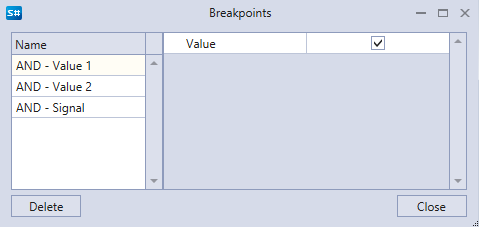

# ブレークポイント

ブレークポイントを追加するには、キューブを選択して **ブレークポイントを追加** ボタンをクリックします。ブレークポイントは赤い円で強調表示されます。

要素でブレークポイントが作動すると、その背景が薄い赤色に変わります。
その要素はプロパティウィンドウで自動的に強調表示され、そこにプロパティと入力および出力パラメーターの値が表示されます。
入力または出力パラメーターにマウスを合わせると、パラメーター値を含むプロンプトが表示されます。
ストラテジー実行中に複合要素の入力および出力の値を表示する例を、下図に示します。

ブレークポイントは、テストプロセスの開始前にも、履歴上でのストラテジーテスト中にも追加できます。

**ブレークポイント** ボタンをクリックすると、すべてのブレークポイントが表示されるウィンドウが開きます。それぞれに追加のトリガー条件を設定できます。たとえば、論理シグナルに **True** 値を設定できます。この場合、ブレークポイントはシグナル値が **True** の場合にのみ停止します。

## 推奨コンテンツ

[ステップ実行](step_by_step_execution.md)
