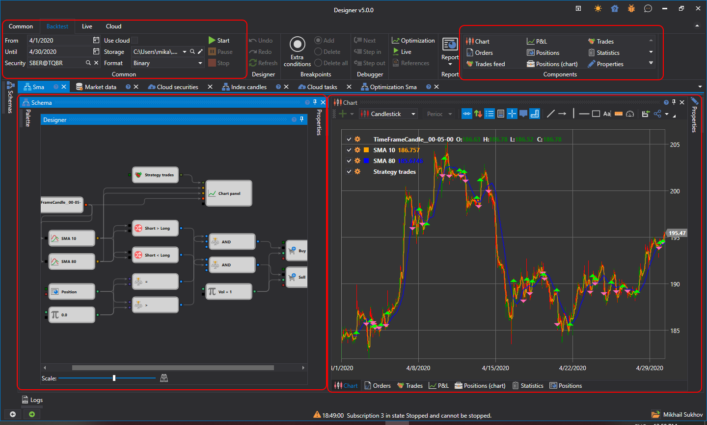

# ユーザーインターフェイス

履歴データでテストを実行するには、履歴データでテストするスキーマを持つストラテジーを選択する必要があります。ストラテジーは、ストラテジーフォルダー内の [Schemas](../user_interface/schemas.md) パネルで、対象のストラテジーをダブルクリックして選択します。ワークスペース用にストラテジーを選択すると、ストラテジーの新しいタブが表示され、このタブに切り替えると、Ribbon の **Emulation** タブが自動的に開きます。

**Emulation** タブでは、ストラテジー名を変更し、簡単な説明を付けることができます。

履歴データでテストを実行するには、**Emulation tab** で Market Data フィールドに履歴データへのパスを指定し、テスト期間を設定します。テスト用ストラテジーは、**Start button**  をクリックして開始します。テスト用ストラテジーを開始すると、テストを一時停止する **Pause**  ボタンと、テストを完全に停止する **Stop**  ボタンがアクティブになります。ストラテジーを編集する際には、最後の操作を取り消す **Undo(Ctrl+Z)** 、取り消しを戻す **Redo(Ctrl+Y)** 、スキーマを完全に更新する **Refresh(Ctrl+R)**  ボタンが便利です。また、**Emulation tab** から **Debugger**（[デバッグ](debugging.md)）を使用したり、ストラテジーの **Optimization** を実行したりできます。

選択したストラテジータブには、既定で次のパネルが含まれます。

- **Scheme** パネル。キューブと接続線を組み合わせて、ストラテジーとそのコンポーネントの設計に関する主な作業を行います。Scheme については、[ダイアグラムパネル](../strategies/using_visual_designer/diagram_panel.md) セクションで詳しく説明しています。
- 情報要素のパネル。**Chart**、**Orders**、**Trades**、**Statistics** などのコンポーネントを含みます。必要なコンポーネントは、**Emulation** タブの **Components** グループで選択して追加できます。
- **Properties** パネルは、既定ではストラテジータブの右側に折りたたまれています。**Properties** パネルでは、**Emulation** の一般設定を構成できます。たとえば、選択したストレージのファイル形式に応じて、**Market-data storage format** を **BIN** または **CSV** に設定できます。データ型は Ticks または Candles にできます。Ticks を選択した場合、ローソク足は [バックテスト設定](../user_interface/components/backtesting_settings.md) で指定されたティックから形成されます。

## 推奨コンテンツ

[バックテスト設定](../user_interface/components/backtesting_settings.md)
