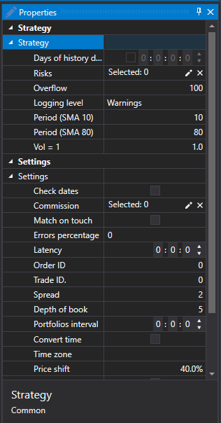

# シミュレーター

[Designer](../../designer.md) では、作成したストラテジーを **シミュレーション** モードで実行できます。**シミュレーション** をカスタマイズするには、次の操作を実行する必要があります。

1. **接続**  ボタンの横にある矢印をクリックすると、**エミュレーター設定** ボタンが表示されます。

2. **エミュレーター設定** ボタンをクリックすると、**エミュレーター設定** ウィンドウが開きます。

1. **シミュレーター**

- **エミュレーターを使用** - エミュレーターを使用します。
- **銘柄** - 銘柄。

2. **設定**

- **タッチ時にマッチング** - エミュレーション中、約定価格が注文価格に接触したとき（つまり、注文価格と等しいとき）に約定を結合します。
- **板情報（有効期間）** - エミュレーター内で板が保持される最大時間です。この時間内に更新がない場合、板は消去されます。このプロパティは、データに欠落がある場合に古い板を削除するために使用できます。
- **エラー率** - 新規注文を登録するときのエラーの割合値です。値は 0（エラーなし）から 100 までです。
- **遅延** - 登録済み注文の遅延の最小値です。
- **再登録** - 単一の約定という形式で注文の再登録がサポートされるかどうか。
- **バッファリング期間** - 応答を単一パッケージ内のバッチとして送信します。ネットワーク遅延と取引所コアのバッファー処理がエミュレートされます。
- **注文 ID** - エミュレーターが注文の識別子を生成するときの開始番号です。
- **約定 ID** - エミュレーターが約定の識別子を生成するときの開始番号です。
- **トランザクション** - エミュレーターが注文トランザクションの識別子を生成するときの開始番号です。
- **スプレッドサイズ** - 価格刻み単位でのスプレッドサイズです。ティック約定から板を生成する際にスプレッドを決定するために使用されます。
- **板の深さ** - ティックから生成される板の最大深さです。
- **出来高ステップ数** - 注文がティック約定より大きい場合の出来高ステップ数です。ティック約定をテストするときに使用されます。
- **ポートフォリオ間隔** - ポートフォリオ再計算間隔です。間隔がゼロの場合、再計算は実行されません。
- **時刻変換** - 注文と約定の時刻を取引所時刻に変更します。
- **タイムゾーン** - 取引所のタイムゾーンに関する情報です。
- **価格シフト** - 最終約定からの価格シフトで、次のセッションの最大価格と最小価格の境界を決定します。
- **追加出来高** - 大量注文を登録するときに板注文へ追加の出来高を追加します。

## 推奨コンテンツ

[チャート](../user_interface/components/chart.md)
