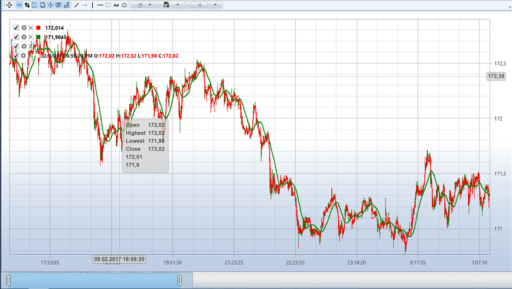

# Live 実行の例

**Live** で例を実行するには、以下が必要です。

1. [Interactive Brokers](../../api/connectors/stock_market/interactive_brokers.md) のテスト用ターミナル **IB Trader Workstation (TWS) Demo**。これはメーカーの Web サイトから入手できます。

2. [Designer](../../designer.md) で動作するように IB TWS Demo ターミナルを設定します。[Interactive Brokers](../../api/connectors/stock_market/interactive_brokers.md) セクションの **IB TWS Setting demo** を参照してください。

3. [Designer](../../designer.md) で IB TWS Demo への接続を設定し、接続します。

4. 必要な銘柄の履歴をダウンロードします。例では **AAPL@NASDAQ** 銘柄を使用します。ストラテジーは 5 秒の時間枠のローソク足を使用し、履歴は不要ですが、このような履歴があれば可能性を示すには十分です。

5. ストラテジーを設定して実行します。

SMA ストラテジーを使用する例では、以下のパラメーターを使用します。

- **AAPL@NASDAQ** 銘柄
- 標準ストレージ **\\Documents\\StockSharp\\Designer\\Storage**
- ストレージ形式 - **CSV**
- ストレージから取得するデータの種類 - **Ticks**
- 時間枠 5 s のローソク足
- 数量 - 100
- 履歴日数 - 2

必要なすべてのパラメーターを設定したら、 Start ボタンをクリックして、ストラテジーのライブ取引を開始します。

 Start ボタンをクリックすると、チャートにはダウンロード済みの 2 日分の履歴全体が表示され始めます。

[マーケットデータストレージ](../market_data_storage.md) から履歴全体をダウンロードし、ターミナルから匿名取引のテーブルを取得すると、ストラテジーは取引を開始します。

以下は、同じ時間帯についての [Designer](../../designer.md) と取引ターミナルのチャートです。

[Designer](../../designer.md) のチャート:

取引ターミナルのチャート:

## 関連項目

[マーケットデータストレージ](../market_data_storage.md)
