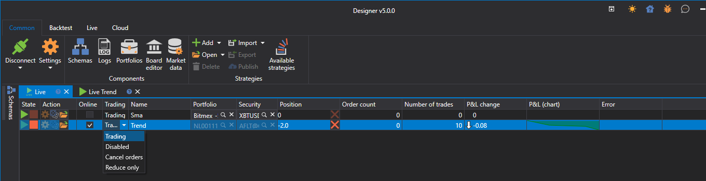

# ストラテジーダッシュボード

**ライブ** タブの  ボタンをクリックすると、**ライブ** パネルが開きます。

**ライブ** パネルは、**ライブ** に追加されたすべてのストラテジーを表示するテーブルです。**ライブ** パネルでは、ストラテジーの現在の状態を確認し、、 ボタンを使用してストラテジーを実行または停止できます。

- 1 番目の列は、ストラテジーの開始/停止を担当します。
- 2 番目の列は、ストラテジー設定用です。
- **オンライン** は、すべてのストラテジー指標が形成され、すべてのサブスクリプションが **オンライン** [状態](../../api/market_data/subscriptions.md) に遷移したかどうかを示します。
- **取引** では、利用可能な操作を変更できます。たとえば、新しいポジションの建玉や既存ポジションの増加を禁止できます。
- **ポジション** は、ストラテジーの銘柄に対する現在のポジションを表示します。クロスボタンをクリックすると、ポジションがクローズされます。
- その他の列には、ストラテジーの現在の取引統計が表示されます。

選択した行をダブルクリックすると、そのストラテジーのパネルが開きます。

## 推奨コンテンツ

[Live 実行の例](live_execution_sample.md)
