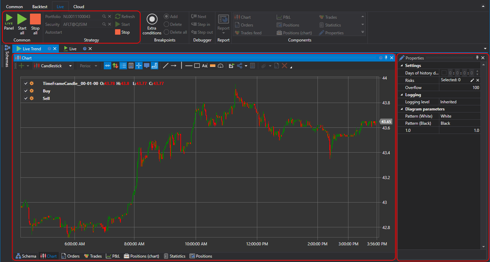

# インターフェイス

**Live** フォルダーにストラテジーを追加した後、追加したストラテジーをダブルクリックすると、"Live [Strategy Name]" というタイトルのタブが開きます。このタブに移動すると、**Ribbon** の **Live** タブが自動的に開きます。**Live** タブでは、ストラテジーが使用する銘柄とポートフォリオを指定できます。**Start** ボタンを押すと、ストラテジーのライブ取引が開始され、**Stop** ボタンを押すと停止されます。

ストラテジータブには、[Strategy Designer](../strategies/using_visual_designer/diagram_panel.md) で説明されているものと同様に、スキームおよびコンポーネント要素用の Strategy Designer が含まれます。さらに、このタブには [Live Trading Properties](../user_interface/components/live_settings.md) パネルも含まれており、既定では折りたたまれてタブの右側に固定されています。

ストラテジーを **Live** に追加する処理では、元のコードからコピーが作成されます（[スキーム](../strategies/using_visual_designer.md)または[コード](../strategies/using_code.md)を使用している場合）。したがって、**Live** コピー内のアルゴリズムを変更しても、元のものには影響しません。ストラテジー起動時に **Live** と元のものの間に不一致がある場合、警告が表示されます。

- **Yes** は、元のものから **live** コピーへ変更を適用することを意味します。
- **No** は、差異を無視し、変更を適用せずに **live** コピーを起動することを意味します。
- **Cancel** は、何も起動しないことを意味します。

**Live** コピーでの変更は、テストと、その後に元のものへ移すことを目的とした最小限のものにする必要があります。そうしないと、**Live** コピーが元のバージョンに更新された場合に変更が失われるリスクがあります。

## 関連項目

[接続設定](../connections_settings.md)
