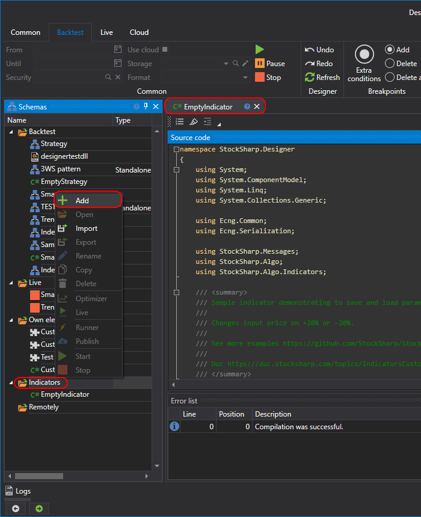
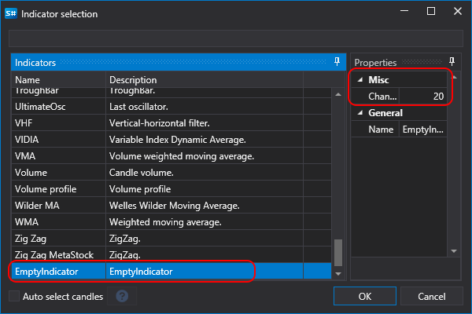

# C# でインジケーターを作成する

[API](../../../../api.md) で独自のインジケーターを作成する方法は、[カスタムインジケーター](../../../../api/indicators/custom_indicator.md) セクションで説明されています。このようなインジケーターは **Designer** と完全に互換性があります。

インジケーターを作成するには、**スキーム** パネルで **インジケーター** フォルダーを選択し、右クリックしてコンテキストメニューから **追加** を選択する必要があります。



インジケーターのコードは次のようになります。

```cs
/// <summary>
/// パラメーターの保存と読み込みを示すサンプルインジケーターです。
///
/// 入力価格を +20% または -20% 変更します。
///
/// その他の例は https://github.com/StockSharp/StockSharp/tree/master/Algo/Indicators を参照してください。
///
/// ドキュメント https://doc.stocksharp.com/topics/Designer_Creating_indicator_from_source_code.html
/// </summary>
public class EmptyIndicator : BaseIndicator
{
	private int _change = 20;

	public int Change
	{
		get => _change;
		set
		{
			_change = value;
			Reset();
		}
	}

	private int _counter;
	// 形成済みインジケーターは、取引で利用可能になるために必要な入力をすべて受け取っています。
	private bool _isFormed;

	protected override bool CalcIsFormed() => _isFormed;

	public override void Reset()
	{
		base.Reset();

		_isFormed = default;
		_counter = default;
	}

	protected override IIndicatorValue OnProcess(IIndicatorValue input)
	{
		// 10 回に 1 回、空の値を返そうとします。
		if (RandomGen.GetInt(0, 10) == 0)
			return new DecimalIndicatorValue(this);

		if (_counter++ == 5)
		{
			// 例として、このインジケーターは形成済みになるために 5 つの入力を必要とします。
			_isFormed = true;
		}

		var value = input.GetValue<decimal>();

		// 現在値を +20% または -20% の範囲でランダムに変更します。

		value += value * RandomGen.GetInt(-Change, Change) / 100.0m;

		return new DecimalIndicatorValue(this, value)
		{
			// final 値は、指定された入力に対するこの値が
			// これ以上変更されないことを意味します (例: 最終価格で変化するローソク足)。
			IsFinal = RandomGen.GetBool()
		};
	}

	// アプリの以降の再起動に備えて、プロパティを保存します。

	public override void Load(SettingsStorage storage)
	{
		base.Load(storage);
		Change = storage.GetValue<int>(nameof(Change));
	}

	public override void Save(SettingsStorage storage)
	{
		base.Save(storage);
		storage.SetValue(nameof(Change), Change);
	}

	public override string ToString() => $"Change: {Change}";
}
```

このインジケーターは入力値を受け取り、**変更** パラメーター値に基づいて任意の偏差を加えます。

インジケーターメソッドの説明は、[カスタムインジケーター](../../../../api/indicators/custom_indicator.md) セクションで確認できます。

作成したインジケーターをダイアグラムに追加するには、[インジケーター](../../using_visual_designer/elements/common/indicator.md) キューブを使用し、その中で必要なインジケーターを指定する必要があります。



インジケーターコードで以前に設定した **変更** パラメーターは、プロパティパネルに表示されます。

> [!WARNING]
> C# コードのインジケーターは、C# コードで作成されたストラテジーでは使用できません。[キューブから](../../using_visual_designer.md)作成されたストラテジーでのみ使用できます。
