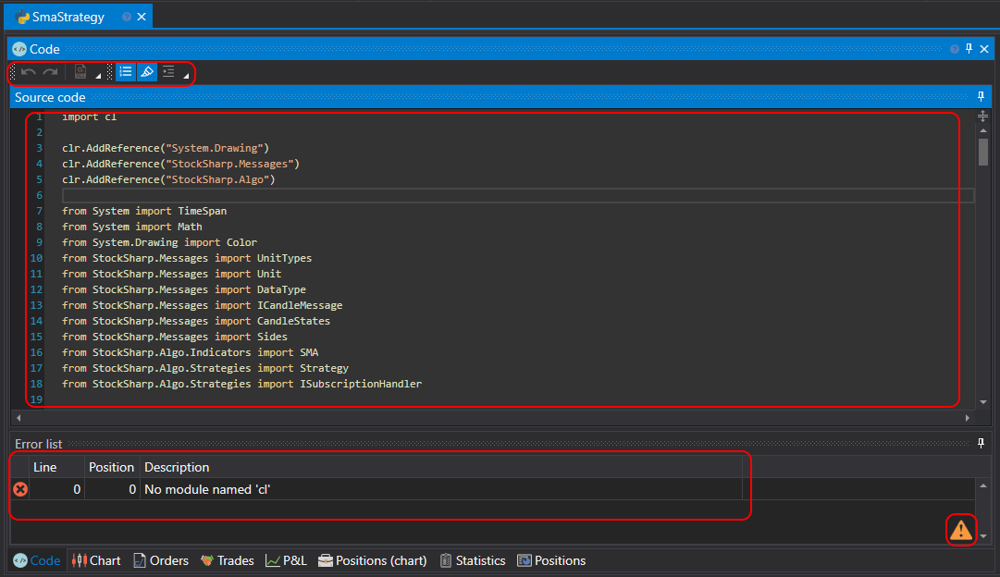

# Python の使用

コードからストラテジーを作成する方法は、Python コードで作業することを好むユーザー向けです。このようなストラテジーはスキームとは異なり機能面の制限がなく、任意のアルゴリズムを実装できます。

ストラテジー作成プロセスは、[Designer](../../../designer.md) 内で直接行うことも、**Python** 開発環境（最もよく使われる開発環境は **Visual Studio** と **JetBrains Rider**）で行うこともできます。その際は、**Python** で取引ロボットを専門的に開発するためのライブラリと [API](../../../api.md) を使用します。

**共通** タブで **追加** ボタン  をクリックし、**ストラテジー** を選択すると、新しいストラテジーを追加できます。または、**スキーム** パネルの **ストラテジー** フォルダーを右クリックし、ドロップダウンメニューの **追加** ボタン  をクリックします。

**追加** ボタン  をクリックすると、ストラテジーを作成するコンテンツタイプを選択するウィンドウが表示されます。

Python コードからストラテジーを作成するには、2 番目のタブを選択します。初期コードとして使用するテンプレートを選択することもできます。

**確定** をクリックすると、[スキーム](../using_visual_designer.md)からストラテジーを作成した場合と同様に、**スキーム** パネルの **ストラテジー** フォルダーに新しいストラテジーが表示されます。ストラテジーの削除や名前変更の操作も同様です。

ただし、スキームの代わりに Python コードエディターが表示されます。

コードエディタータブは、**ソースコード** パネルと **エラー一覧** パネルで構成されます。**ソースコード** パネルには Python コードエディター本体があります。上部にはツールバーがあり、**現在行**、**行番号** などのハイライト表示を有効または無効にできます。フォントサイズを大きくするには、CTRL+MouseWheel の組み合わせを使用できます。

**エラー一覧** パネルはコードエラーの一覧を含むテーブルです。行をダブルクリックすると、**ソースコード** パネル内のエラー位置へカーソルが自動的に移動します。

コードを編集すると、**エラー一覧** パネルの右下隅にアイコン  が表示され、変更追跡が開始されたことを示します。コードの変更が停止するとコンパイルが行われます。

[バックテスト](../../backtesting/user_interface.md)、[ライブ](../../live_execution/getting_started.md)でのストラテジー実行、およびその他の操作は、スキームから作成したストラテジーと同様に動作します。

## 制限事項

> [!WARNING]
> [Designer](../../../designer.md) は IronPython を使用しており、次の制限があります。
> - Python バージョン 3.4 との互換性
> - 特別な .NET 実装による numpy の部分的なサポート（使用例は[こちら](https://github.com/StockSharp/StockSharp/blob/master/Algo.Analytics.Python/pearson_correlation_script.py)にあります）
> - C で書かれた他の一般的なライブラリ（pandas、scipy など）のサポートなし
> - 非同期プログラミングのサポートが限定的
> - CPython 固有の実装に依存するため、一部の組み込み Python モジュールを使用できない
> - 一部の操作では CPython と比較してパフォーマンスが低くなる可能性がある
>
> [Designer](../../../designer.md) 内で Python による取引ストラテジーを開発する際は、これらの制限を考慮することを推奨します。
