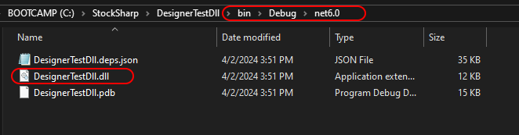

# DLL の使用

既製の DLL を使用する方法は、**Visual Studio** や **JetBrains Rider** 環境で継続的に作業したいユーザーにとってなじみのある方法です。この方法には、**Designer** 内で[コード](using_code.md)を書く方法に比べて、いくつかの利点があります。

- **Designer** 内の組み込みエディターと比較して、より強力なコードエディターを使用できます。
- コードを再コンパイルすると、**Designer** 内のコンテンツが自動的に更新されます。
- コードを複数のファイルに分割できます（[コード](using_code.md)方式の場合、OneFile-OneStrategy バリアントのみが可能です）。
- [デバッガー](using_dll/debug_dll_in_visual_studio.md)を使用できます。

### Visual Studio でプロジェクトを作成

1. **Visual Studio** でストラテジーを作成するには、プロジェクトを作成する必要があります。

2. 次に、ストラテジーコードを書く必要があります。すぐに始めるには、[コードからのストラテジー](using_code/csharp/first_strategy.md)でテンプレートとして作成される SmaStrategy コードをコピーできます。

3. コードをコンパイルするには、NuGet パッケージ [StockSharp.Algo](https://www.nuget.org/packages/stocksharp.algo) を含めます。これには、すべてのストラテジーの基底クラス [Strategy](xref:StockSharp.Algo.Strategies.Strategy) が含まれています。

ストラテジーがチャート関連インターフェイスを使用する場合は、NuGet パッケージ [StockSharp.Charting.Interfaces](https://www.nuget.org/packages/stockSharp.charting.interfaces) を含めます。これらのインターフェイスには実際のチャートロジックは含まれておらず、コードをコンパイルするためだけに必要です。ストラテジーが **Designer** で実行されると、実際のチャート描画はこれらのインターフェイスを通じて行われます。

4. ストラテジーを作成した後、**ビルド** タブの **ソリューションをビルド** を押してプロジェクトをビルドする必要があります。

5. Visual Studio では既定で、プロジェクトは `…\bin\Debug\net6.0` フォルダーにビルドされます。

### DLL を Designer に追加

1. DLL からストラテジーを追加する操作は、[コード](using_code.md)からストラテジーを作成する操作と似ています。ただし、コンテンツタイプの定義段階で **DLL** を選択する必要があります。

2. ウィンドウで、アセンブリへのパス（.NET 6.0 と互換性がある必要があります）を指定し、型を選択する必要があります。後者が必要なのは、1 つの DLL に複数のストラテジー（または[インジケーター付きキューブ](using_dll/create_element_and_indicator.md)）を含められるためです。**確定** をクリックすると、ストラテジーが **スキーマ** パネルに追加され、使用できる状態になります。

3. [バックテスト](../backtesting/user_interface.md)、[ライブ](../live_execution/getting_started.md)でのストラテジー起動、およびその他の操作は、ダイアグラムやコードから作成したストラテジーと同様に動作します。

