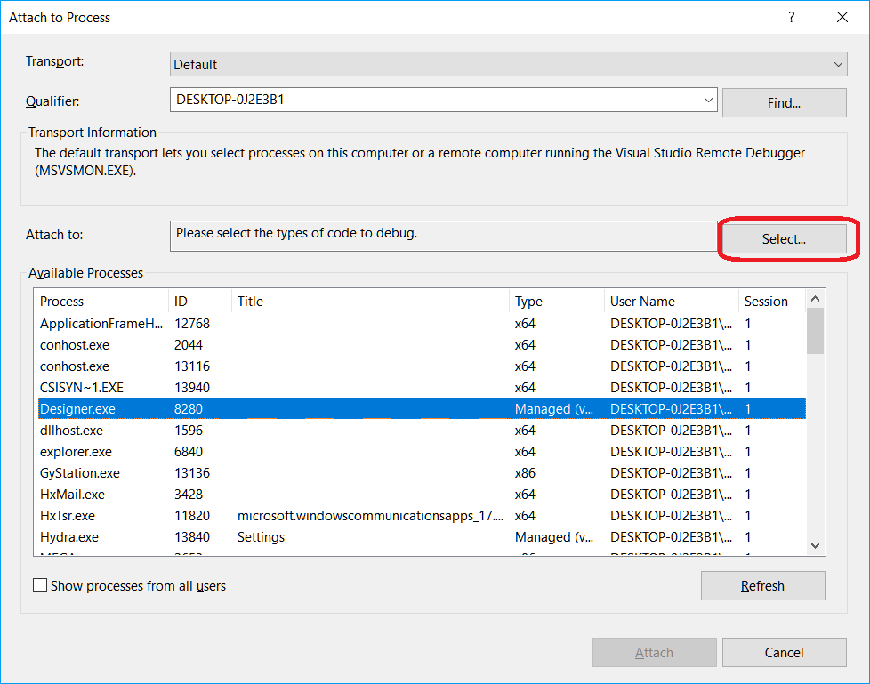

# Visual Studio で DLL をデバッグ

Visual Studio には、Visual Studio デバッガーを使用して実行中のプロセスへアタッチする仕組みがあります。Visual Studio デバッガーについては、ドキュメント [Attach to running processes](https://learn.microsoft.com/en-us/visualstudio/debugger/attach-to-running-processes-with-the-visual-studio-debugger?view=vs-2022) で詳しく説明されています。デバッグプロセスは、[DLL の使用](../using_dll.md)セクションで追加したストラテジーを例に示します。

1. プロセスにアタッチして DLL ストラテジーのデバッグを開始するには、DLL がメモリに読み込まれている必要があります。DLL は[ストラテジーを追加](../using_dll.md)した後にメモリへ読み込まれます。DLL がメモリに読み込まれたら、プロセスにアタッチできます。

2. Visual Studio で **Debug -> Attach to Process** を選択します。

3. **Attach to Process** ダイアログボックスで、アタッチしたい **Designer.exe** プロセスを **Available processes** リストから探します。

プロセスが別のユーザーアカウントで実行されている場合は、**Show processes from all users** チェックボックスをオンにする必要があります。

4. **Attach to** ウィンドウで、デバッグする必要があるコードタイプが指定されていることが重要です。既定の **Auto** パラメーターはデバッグ対象のコードタイプを判定しようとしますが、常に正しく識別できるとは限りません。コードタイプを手動で設定するには、次の手順を実行する必要があります。

- Attach to フィールドで **Select** をクリックします。
- **Select Code Type** ダイアログボックスで **Debug these code types** ボタンをクリックし、デバッグ対象の型を選択します。
- OK をクリックします。

5. Attach ボタンをクリックします。

6. Visual Studio でコードにブレークポイントを設定します。ブレークポイントが赤く、赤で塗りつぶされている場合 （かつ Studio がデバッグモードの場合）、正確なバージョンの DLL が読み込まれたことを意味します。ブレークポイントが赤く、白で塗りつぶされている場合 （かつ Studio がデバッグモードの場合）、誤ったバージョンの DLL が読み込まれたことを意味します。

7. この例では、ブレークポイントは **public void ProcessCandle(Candle candle)** メソッドの最初の行に設定されています。ストラテジーが [Designer](../../../designer.md) で実行され、ローソク足の値が DLL に渡され始めるとすぐに、Visual Studio はブレークポイントで停止します。そこから、コードの実行を追跡できます。

> [!WARNING] 
> デバッガー下でコードが停止している間、**Designer** プログラム内のすべてのプロセスは一時停止します。プログラムが実取引に接続されている場合、デバッガーで長時間停止すると切断が発生します。

## 関連項目

[ストラテジーのエクスポート](../../export_import/export.md)
