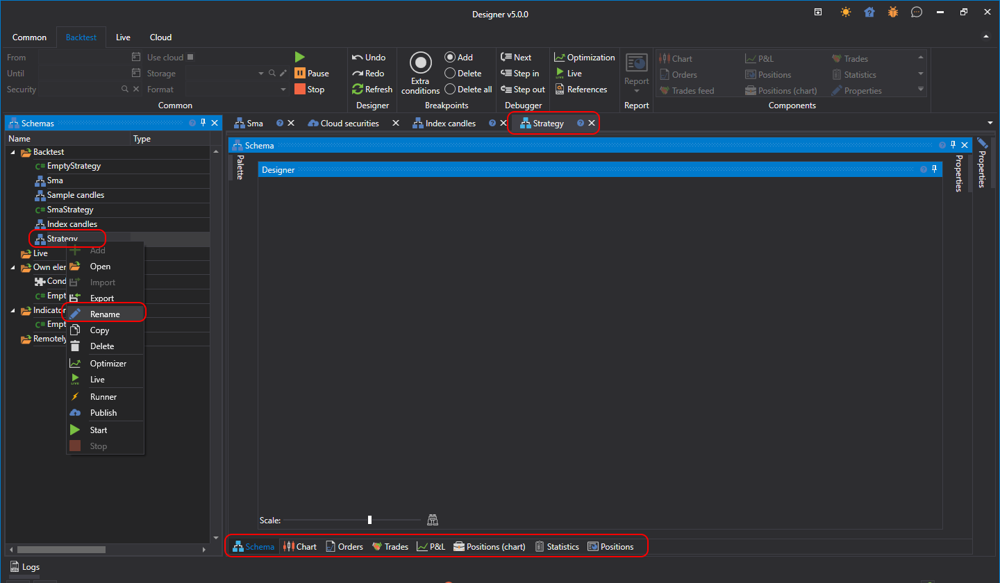

# ブロックの使用

ブロックを使用する場合、プログラミングスキルは不要です。ストラテジーを作成するプロセスでは、ブロックと接続（線）を組み合わせ、ワークフロー全体を視覚的に表現します。

**共通** タブで **追加**  ボタンを押し、**ストラテジー** を選択すると、新しいストラテジーを追加できます。または、**スキーム** パネルの **ストラテジー** フォルダーを右クリックし、ドロップダウンメニューの **追加**  ボタンを押します。

**追加**  ボタンを押すと、ストラテジーを作成するコンテンツタイプを選択するウィンドウが表示されます。

ブロックからストラテジーを作成するには、**スキーム** タブを選択する必要があります。初期スキームとして使用するテンプレートを選択することもできます。

**OK** を押すと、**スキーム** パネルの **ストラテジー** フォルダーに新しいストラテジーが表示されます。ワークスペースにはそのストラテジーの新しいタブが表示され、そこへ移動するとリボンの **バックテスト** タブが自動的に開きます。**スキーム** パネルでストラテジーを右クリックすると、ストラテジー名の変更などを行えるメニューが開きます。

ストラテジータブは、**スキーム** パネル（[ストラテジーデザイナー](using_visual_designer/diagram_panel.md)）と、**スキーム** 領域で作成されたストラテジーのテスト結果を表示するために必要な、ストラテジーの[グラフィカルコンポーネント](../user_interface/components.md)を表すその他のタブで構成されます。ストラテジーテストの詳細情報は、[バックテストの例](../backtesting/getting_started.md)セクションで説明されています。

## 関連項目

[ストラテジーデザイナー](using_visual_designer/diagram_panel.md)
