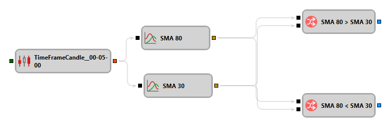
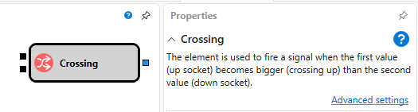

# 複合要素

スキーマを構成するとき、完全な機能を形成し、異なるスキーマや 1 つのスキーマ内でプロパティ値を変えながら何度も使用できる要素の集合がよくあります。このような要素の集合は、個別の複合要素にまとめることができ、その後は通常のキューブと同じように使用されます。

複合要素は、任意のストラテジースキーマと同様に保存、読み込み、編集される通常のスキーマです。

複合要素をスキーマに追加すると、内部キューブすべての未接続パラメーターが自動的に追加されます。キューブ入力側の未接続パラメーターは入力として追加され、出力側の未接続パラメーターは出力として追加されます。追加された各パラメーターには、元の要素とそのパラメーターと同じ名前が付けられます。さらに、この要素には、**パラメーター** プロパティが指定されたすべての要素のプロパティが追加されます。

複合要素の使用方法を、移動平均クロスストラテジーの例で考えます。この例は、[クロス](elements/common/crossing.md) 複合要素を複数回使用する方法を示しています。このストラテジーは、短期移動平均が長期移動平均を下から上へクロスしたときにロングポジションを開き、短期移動平均が長期移動平均を上から下へクロスしたときにショートポジションを開くことができます。移動平均クロスの瞬間を判定する、移動平均クロスストラテジーの一部分のスキーマを次の図に示します。

移動平均のクロスは、その可能な方向（短期が上から下へクロスするか、下から上へクロスするか）だけが異なるため、クロスの瞬間を判定するスキーマの一部を個別の複合要素として取り出すことができます。この要素をスキーマに追加するとき、移動平均クロスアルゴリズムを定義するプロパティを指定します。クロスを判定する複合要素のスキーマを次の図に示します。

複合要素のダイアグラムは単純な要素で構成され、現在値（Prev In 1 と Prev In 2）を記憶し、現在（CurrComparison）と過去（PrevComparison）の値のペアを互いに比較することに基づいています。各入力値はダイアグラム内の 2 つの要素で使用されるため、[組み合わせ](elements/common/combination.md) 要素（In 1、In 2）が複合要素の入力に配置されています。これにより、1 つの入力を 2 つの要素に分割し、入力値を [比較](elements/common/comparison.md) 要素と [前回値](elements/common/prev_value.md) 要素に渡せます。新しい値が入力に到着すると、現在値が比較され、新しい値が [前回値](elements/common/prev_value.md) 要素に渡されます。そこから現在の入力に対する前回値が渡され、その後で前回値が比較されます。両方の条件が満たされると（これは And [論理条件](elements/common/logical_condition.md) を使用してチェックされます）、立てられたフラグの値が複合要素の出力へ渡され、以降のアクションのトリガーとして使用できます。

CurrComparison キューブと PrevComparison キューブでは、**共通** プロパティグループの **パラメーター** フラグが設定されています。そのため、これらのキューブのプロパティは複合要素 [クロス](elements/common/crossing.md) のプロパティに取り込まれ、ストラテジースキーマで複合要素を使用するときに指定されます。

## 推奨コンテンツ

[チャートにローソク足を表示](schema_samples/display_candles_on_chart.md)
