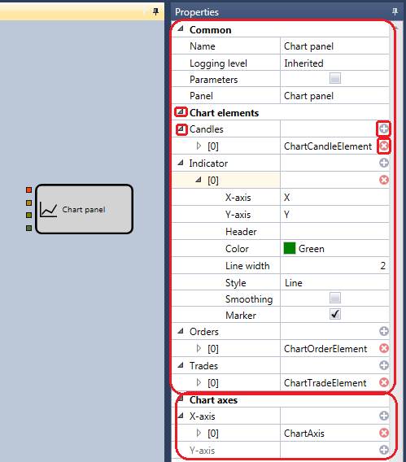
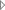

# Chart

このキューブは、[チャート](../../../../user_interface/components/chart.md) パネル上のチャートにデータを表示するために設計されています。各要素はチャート上の 1 つの領域に対応し、チャート上の軸セット、グラフィック要素セット、およびそれらの表示パラメーターを定義できるプロパティのセットを含みます。任意のグラフィック要素の追加は  ボタンを押して行い、削除は  ボタンを押して行います。グラフィック要素（ローソク足系列、インジケーター、約定など）を追加すると、設定内で特別な入力パラメーターがキューブに作成されます。この入力パラメーターを通じて、表示するデータがこのキューブに渡され、その結果として [チャート](../../../../user_interface/components/chart.md) パネルに表示されます。 ボタンをクリックすると、子グラフィック要素またはその設定が開かれます。

[チャート](../../../../user_interface/components/chart.md) パネルには、**Chart panel** キューブで受け取ったすべてのデータが表示されます。異なるローソク足系列には、異なる **Chart panel** キューブを使用する必要があります。その場合、チャートは上下に配置されますが、それぞれのチャートには対応するグラフィック要素（ローソク足系列、インジケーター、約定など）だけが表示されます。例では、上部のチャートにローソク足、2 つのインジケーター、約定が表示されており、これらは上部キューブの 4 つの入力パラメーターに対応しています。下部のチャートにはローソク足のみが表示されています。[チャート](../../../../user_interface/components/chart.md) パネルの詳細については、[チャート](../../../../user_interface/components/chart.md) セクションを参照してください。

## 推奨コンテンツ

[Crossing](crossing.md)

