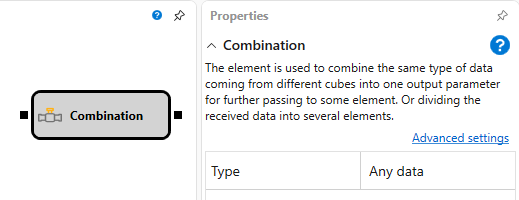

# 組み合わせ

このキューブは、異なるキューブから来る同じ型のデータを 1 つの出力パラメーターに結合して別の要素へ渡すため、または受け取ったデータを複数の要素に分割するために使用します。

## 入力ソケット

- **任意のデータ** - 受信および渡されるデータの型を指定します。

## 出力ソケット

- **任意のデータ** - 受信および渡されるデータの型を指定します。

## パラメーター

- **型** - 受信および渡されるデータの型を指定します。

## 推奨コンテンツ

[比較](comparison.md)

