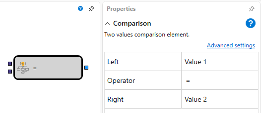

# Comparison

この要素は、2 つの入力オブジェクトを比較するために使用します。

## 入力ソケット

- **Value 1** - 比較可能な値（たとえば、数値、文字列、インジケーター値など）。
- **Value 2** - 比較可能な値（たとえば、数値、文字列、インジケーター値など）。

## 出力ソケット

- **Flag** - フラグ値（状態を示し、up（true）と down（false）の 2 つの値を持ちます）。

## パラメーター

- **Left** - 比較の左辺で使用される値を持つパラメーター。
- **Operator** - 渡された値を比較するために必要な条件。
- **Right** - 比較の右辺で使用される値を持つパラメーター。

演算子を変更すると、キューブ名は演算子名に自動的に変更されます。

## 推奨コンテンツ

[Indicator](indicator.md)

