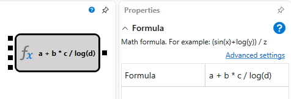

# 数式

このキューブは、任意の数の引数を持つ数式を計算するために使用します。利用可能な一覧から数式を選択することも、独自の数式を記述することもできます。独自の数式を記述する場合、入力ソケットの数は自動的に決定されます。

## 入力ソケット

- **値** - 数学演算を実行できる値（たとえば、数値またはインジケーター）。入力値の数は数式によって異なります。

## 出力ソケット

- **結果** - 数式の計算結果の値。

## パラメーター

- **数式** - 定義済みの数式セット。

標準の数学演算子に加えて、次の関数を使用できます。

- **abs(a)** - 数値の絶対値を返します。
- **acos(a)** - 余弦が指定した数値に等しい角度を返します。
- **asin(a)** - 正弦が指定した数値に等しい角度を返します。
- **atan(a)** - 正接が指定した数値に等しい角度を返します。
- **ceiling(a)** - 指定した数値以上の最小の整数を返します。
- **cos(a)** - 指定した角度の余弦を返します。
- **exp(a)** - **e** を指定した累乗に上げた値を返します。
- **floor(a)** - 指定した数値以下の最大の整数を返します。
- **log(a)** - 指定した数値の自然対数（底 **e**）を返します。
- **log10(a)** - 指定した数値の底 10 の対数を返します。
- **max(a, b)** - 2 つの decimal 数値のうち大きい方を返します。
- **min(a, b)** - 2 つの decimal 数値のうち小さい方を返します。
- **pow(a, b)** - 指定した数値を指定した累乗に上げた値を返します。
- **sign(a)** - 指定した数値の符号を示す整数を返します。
- **sin(a)** - 指定した角度の正弦を返します。
- **sqrt(a)** - 指定した数値の平方根を返します。
- **tan(a)** - 指定した角度の正接を返します。
- **truncate(a)** - 指定した数値の整数部分を計算します。

## 推奨コンテンツ

[インジケーター](indicator.md)

