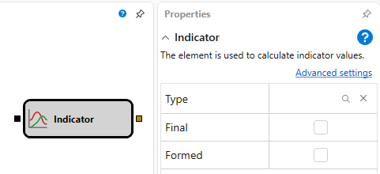

# インジケーター

このブロックは、インジケーター値を計算するために使用します。

## 入力ソケット

- **任意のデータ** - 選択したインジケーターを計算する基礎となる特定のデータ型（インジケーターによって、数値、ローソク足などが該当します）。

## 出力ソケット

- **インジケーター** - 計算されたインジケーター値。チャートパネルへの表示や、以降の計算に使用できます。

## パラメーター

- **インジケータータイプ** - 必要なインジケーターを選択するために使用されるパラメーター、および選択したインジケーター型に対応するいくつかの追加パラメーター。これらのパラメーターのセットは、選択したインジケーター型が変更されると変わります。
- **最終** - インジケーターの[最終値](../../../../../api/indicators.md)のみを渡します。
- **形成済み** - インジケーターが完全に[形成済み](../../../../../api/indicators.md)の場合のみ値を渡します。

## 関連項目

[インジケーター一覧](../../../../../api/indicators/list_of_indicators.md)
[論理条件](logical_condition.md)

