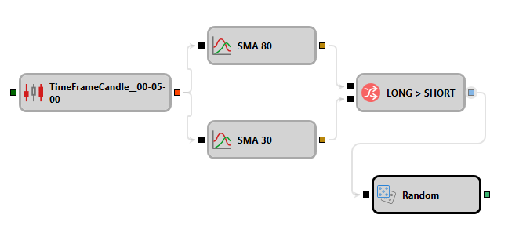

# ランダム値

このブロックは、ランダム値を生成するために使用されます。

## 入力ソケット

- **トリガー** - 生成されたランダム値を出力ソケット経由で渡すタイミングを決定するシグナル（`False` 以外の任意の値）。

## 出力ソケット

- **値** - ランダム値。

## パラメーター

- **最小** - 許容される最小値の境界。
- **最大** - 許容される最大値の境界。

## 関連項目

[ストラテジーの P&L](pnl_strategy.md)
