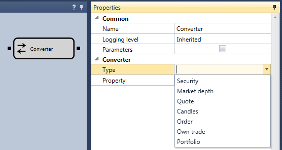

# コンバーター

このキューブは、複合オブジェクトを単純なデータ型に変換するために使用されます。たとえば、銘柄の価格ステップ値を取得できます。

### 入力ソケット

入力ソケット

- **任意のデータ** - 受信される特定の型の複合オブジェクト。

### 出力ソケット

出力ソケット

- **任意のデータ** - 受信したオブジェクトについて選択されたプロパティの値。

### パラメーター

パラメーター

- **データ型** - 入力されるデータの型。入力パラメーターの型は、選択された値に依存します。
- **プロパティ** - 選択された型のプロパティツリーで、キューブの出力で取得できます。使用可能なプロパティのセットは、選択されたデータ型に依存し、必要なデータ型を選択した後にのみ表示されます。
