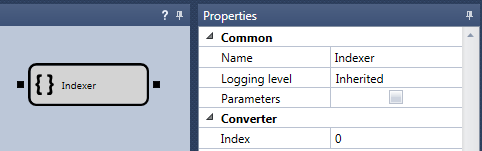

# インデクサー

この要素は、指定されたインデックスを持つ要素をコレクションから取得するために使用されます。

### 入力ソケット

入力ソケット

- **任意のデータ** - 要素のコレクション。

### 出力ソケット

出力ソケット

- **任意のデータ** - パラメーターで指定されたインデックスを持つ、コレクション内の要素。

### パラメーター

パラメーター

- **インデックス** - 必要な要素のインデックス。

## 推奨コンテンツ

[コンバーター](converter.md)
