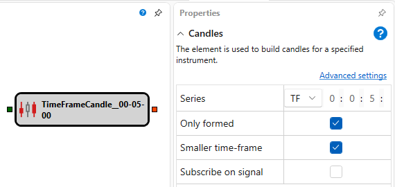

# ローソク足

このブロックは、指定された銘柄のローソク足を構築するために使用されます。

### 入力ソケット

入力ソケット

- **銘柄** - 指定されたパラメーターでローソク足を構築する対象の銘柄。

### 出力ソケット

出力ソケット

- **ローソク足** - 構築されたローソク足。

### パラメーター

パラメーター

- **系列** - ローソク足シリーズの種類と、指定された種類のパラメーター。
- **形成済みのみ** - 完全に形成されたローソク足のみを出力に渡すか、任意の変更を渡すか。
- **小さい時間枠** - より小さい時間枠からローソク足を構築します。
- **シグナルで購読** - トリガーを受信した後にのみデータを購読します。

## 関連項目

[Level 1](level_1.md)
