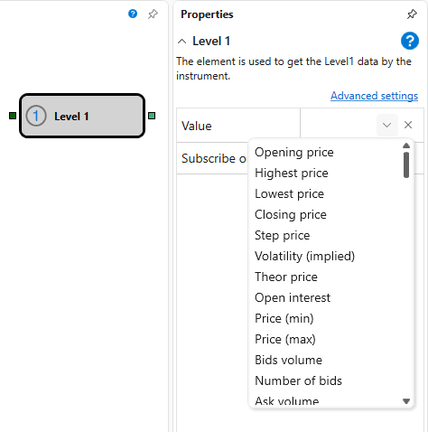

# Level 1

このブロックは、銘柄の **レベル1** データを受信するために使用されます。

### 入力ソケット

入力ソケット

- **銘柄** - **レベル1** データを受信する必要がある銘柄。

### 出力ソケット

出力ソケット

- **変更** - 追跡対象パラメーターの **レベル1** 値。

### パラメーター

パラメーター

- **値** - 追跡する必要がある **レベル1** パラメーター。
- **シグナルで購読** - トリガーが到着した後にのみデータを購読します。

## 関連項目

[ティック](ticks.md)
