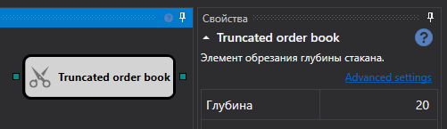

# 深度制限付き板情報

このキューブは、指定された深度まで切り詰められた板情報を取得するために使用します。

### 入力ソケット

- **板情報** は、切り詰める必要がある板情報です。

### 出力ソケット

- **板情報** は、切り詰められた板情報です。

### パラメーター

- **深さ** - 板情報の最大深度。

## 推奨コンテンツ

[IV 板情報](../options/iv_book.md)

