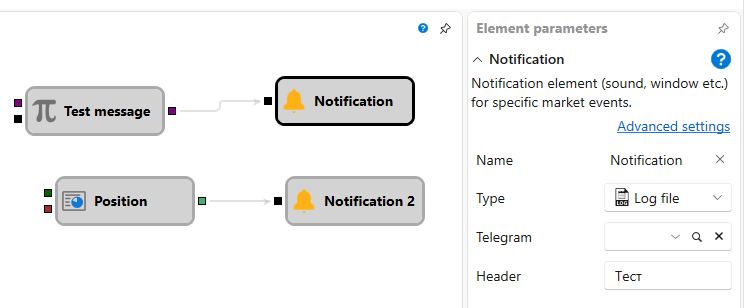

# Notification

このキューブは、入力ソケットにデータが到着したときに通知を送信します。入力値は `ToString` によってテキストに変換されます。固定テキストを送信するには [Variable](../data_sources/variable.md) を接続でき、詳細を確認するには取引またはローソク足のストリームを接続できます。また、カスタムメッセージを準備するには [String format](string_format.md) および [String concat](string_concat.md) キューブを使用できます。

### 入力ソケット

入力ソケット

- **Message** - 送信するデータ。任意の値を受け入れ、文字列に変換します。

### パラメーター

パラメーター

- **Type** - メッセージの種類（ポップアップウィンドウ、電子メール、SMS など）。通知の種類については、[通知設定](../../../../../terminal/notifications.md) セクションで説明されています。
- **Telegram** - Telegram 通知に使用されるチャネル。
- **Header** - メッセージのヘッダー。

## 推奨コンテンツ

[String format](string_format.md)
[String concat](string_concat.md)
[通知設定](../../../../../terminal/notifications.md)

