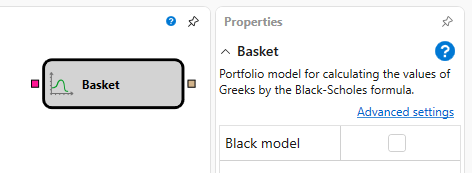
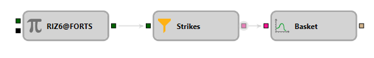

# Basket

このブロックは、オプション価格モデルを作成するために使用します。

### 入力ソケット

入力ソケット

- **Options** - モデルを作成する必要がある権利行使価格。

### 出力ソケット

出力ソケット

- **Model** - 価格モデル（例: Black-Scholes）。

### パラメーター

パラメーター

- **Black Model** - Black-Scholes モデルを作成するかどうかを示すフラグ。

## 関連項目

[Black-Scholes](black_scholes.md)
