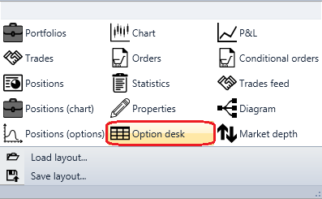

# Option desk

このキューブは、オプションデスクを表示するために使用します。

**Option desk** を表示するには、**Option desk** グラフィックコンポーネントを追加する必要があります。

### 入力ソケット

入力ソケット

- **Model** - 計算モデル（例: Black-Scholes）。

## 推奨コンテンツ

[チャートポジション](chart_positions.md)
