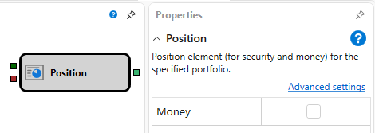

# ポジション

この要素は、指定された銘柄とポートフォリオのポジション変化に関する情報を取得するために使用します。

### 入力ソケット

入力ソケット

- **Instrument** - ポジションを取得する対象の銘柄。
- **Portfolio** - ポジションを取得する対象のポートフォリオ。

### 出力ソケット

出力ソケット

- **Position** - 銘柄のポジション、または口座で現在利用可能な資金額の数値。この値は、ポジションまたは資金が変更されたとき、およびストラテジー開始後に生成されます。

### パラメーター

パラメーター

- **Money** - 入力のフラグが設定されている場合、この要素はポートフォリオのみを受け付け、選択されたポートフォリオの資金ポジションが要素の出力に渡されます。

## 推奨コンテンツ

[ポジション保護](protect.md)
