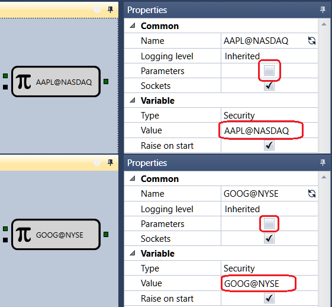

# 最初のストラテジー

ストラテジーおよび複合要素のスキーマを作成し、得られたストラテジーを履歴データでテストするには、移動平均（SMA）ストラテジーの例を使用できます。この例では、ストラテジーの作成からテスト、デバッグまでの完全なサイクルをたどることができます。移動平均（SMA）ストラテジーは、**Schemas** パネルの **Strategies** フォルダーにあります。

1. [コードの使用](../using_code.md) で説明されているように、キューブから新しいストラテジーを作成します。新しいストラテジーを追加するには、**Common** タブの **Add**  ボタンをクリックし、**Strategy** を選択します。または、**Schemas** パネルの **Strategy** フォルダーを右クリックし、ドロップダウンメニューで **Add**  ボタンをクリックします。

**Schemas** パネルの **Strategy** フォルダーで **Add**  ボタンをクリックすると、新しいストラテジーが表示されます。ワークスペースにはストラテジーの新しいタブが表示され、そのタブに切り替えると、リボンの **Emulation** タブが自動的に開きます。**Emulation** タブでは、ストラテジーの名前を変更し、簡単な説明を付けることができます。

2. 作業しやすくするために、 ボタンをクリックして、**Schemas** 領域の **Palette** パネルと **Properties** パネルを開いてピン留めします。結果として、次のようなウィンドウになります。

3. 移動平均（SMA）ストラテジーの要点は次のとおりです:

- 計算期間が異なる 2 つの移動平均、長期 SMA と短期 SMA があります。この例では、長期 SMA の [Indicator](elements/common/indicator.md) キューブは Long SMA と呼ばれ、期間は 80 本のローソク足です。短期 SMA は Short SMA と呼ばれ、期間は 10 本のローソク足です。
- 短期移動平均が長期移動平均を下から上へクロスしたら、ロングポジションを開きます。
- 短期移動平均が長期移動平均を上から下へクロスしたら、ショートポジションを開きます。
- ポジションを開くシグナルを受け取った時点で反対ポジションがある場合は、ポジションを反転します。

4. すべてのストラテジーでは、取引に使用するインストゥルメントとポートフォリオが必要です。これらを **Palette** パネルから **Designer** パネルに追加する必要があります。この例では、**Instrument** 型の [Variable](elements/data_sources/variable.md) キューブを Instrument、**Portfolio** 型の [Variable](elements/data_sources/variable.md) キューブを Portfolio と呼びます。Instrument キューブと Portfolio キューブの **Parameters** チェックボックスを設定します。チェックボックスが選択されている場合、キューブはストラテジー設定から値を取得します。チェックボックスを選択しない場合は、インストゥルメントとポートフォリオの値を手動で入力する必要があります。[Variable](elements/data_sources/variable.md) キューブの Value フィールドを空のままにし、パラメーターのチェックボックスも設定しない場合、テスト中にストラテジーは [Variable](elements/data_sources/variable.md) キューブの未設定値に関するエラーを出します。

ストラテジーで複数のインストゥルメントまたはポートフォリオを使用する必要がある場合は、各キューブで **Parameters** ボックスのチェックを外し、インストゥルメントまたはポートフォリオの値を設定する必要があります。

5. インストゥルメントとポートフォリオを追加した後、2 つの [Indicator](elements/common/indicator.md) キューブを追加し、SMA 型を選択します。1 つ目に Long SMA という名前を付け、期間を 80 本のローソク足に設定します。2 つ目に Short SMA という名前を付け、期間を 10 本のローソク足に設定します。

6. インジケーターを動作させるには、ローソク足系列を渡します。そのために、[Candles](elements/data_sources/candles.md) キューブを作成します。この例では、時間枠が 5 分の形成済みローソク足のみを使用します。

7. インジケーターを追加した後、インジケーターの交差を定義する 2 つのキューブを追加する必要があります。これらは複合要素の [Crossing](elements/common/crossing.md) キューブです。1 つ目のキューブは Crossing Up と呼ばれます。これは下から上への交差を定義します。Short SMA インジケーターはキューブの上側入力に渡され、Long SMA インジケーターは下側入力に渡されます。CurrComparison 演算子はより大きい値に設定され、PrevComparison 演算子は以下に設定されます。2 つ目のキューブは Crossing Down と呼ばれ、上から下への交差を定義します。Short SMA インジケーターはキューブの上側入力に渡され、Long SMA インジケーターは下側入力に渡されます。CurrComparison 演算子はより小さい値に設定され、PrevComparison 演算子は以上に設定されます。

8. ローソク足、インジケーター、取引を視覚的に表示するために、[Chart](elements/common/chart.md) を追加します。[Chart](elements/common/chart.md) に、ローソク足、2 つのインジケーター、取引用の表示要素を追加します。

9. チャートに表示する取引のソースとして、ストラテジーの **Trades** キューブを使用します。この例では Strategy trades と呼ばれます。

10. ポジションを開くには、2 つの [Register order](elements/orders/register.md) キューブを追加します。1 つ目のキューブは成行注文による買い用です。このキューブの入力には、**Instrument**、Crossing Up 交差キューブからのポジションオープンシグナル、**Portfolio**、注文数量が渡されます。2 つ目のキューブは成行注文による売り用です。このキューブの入力には、**Instrument**、Crossing Down 交差キューブからのポジションオープンシグナル、**Portfolio**、注文数量が渡されます。

11. 上記の要素を線（[線](lines.md)）で接続すると、ストラテジーの現在ポジションを考慮しないスキーマが得られます。この状態では、過剰な数量のロットを取得してしまいます。

ポジションを制御するには、[Position](elements/positions/current.md) を追加する必要があります。このキューブの入力には **Instrument** と **Portfolio** が渡されます。

現在ポジションを処理するには、[現在ポジションの取得](schema_samples/get_current_position.md) で説明されている既製のスキーマを使用できます。このスキーマは、必要な注文数量の実際の値を決定します。ポジションを反転する必要がある場合は、ポートフォリオ値の 2 倍を返します。

12. 結果として、完成したストラテジーは次のようになります:

## 推奨コンテンツ

[複合要素](composite_elements.md)
