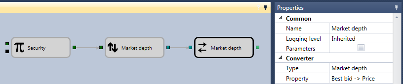

# 銘柄の最良価格を取得する

銘柄の現在の最良価格で買い注文を登録するには、次のスキーマを使用できます:

[変数](../elements/data_sources/variable.md) キューブでは、**銘柄** データ型が選択されています。銘柄が指定されていないが、**共通** プロパティグループの **パラメーター** フラグが設定されている場合、それはストラテジーから取得され、[板情報](../elements/market_depths/order_book.md) キューブに渡されます。[板情報](../elements/market_depths/order_book.md) キューブは、変数から現在の銘柄を受け取った後、選択された銘柄の板情報の更新を出力パラメーターを通じて渡します。板情報の更新を受け取ると、[コンバーター](../elements/converters/converter.md) キューブはそこから現在の最良買い価格の値を選択します。

## 推奨コンテンツ

[現在ポジションを取得する](get_current_position.md)
