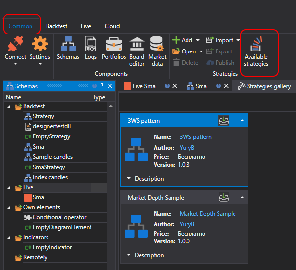

# ストラテジーギャラリー

**戦略ギャラリー** では、既製の取引ストラテジーをコンピューターにダウンロードできます。**共通** タブの **戦略ギャラリー** ボタンをクリックすると、**戦略ギャラリー** を開くことができます。

ストラテジーをコンピューターにダウンロードするには、次の操作が必要です:

- 目的のストラテジーを選択し、ダウンロードボタンをクリックします:

  

- ストラテジーが **バックテスト** セクションのストラテジーツリーに追加されます:

  

## 関連項目

[ストラテジーの公開](strategy_gallery/publish_own_strategy.md)
