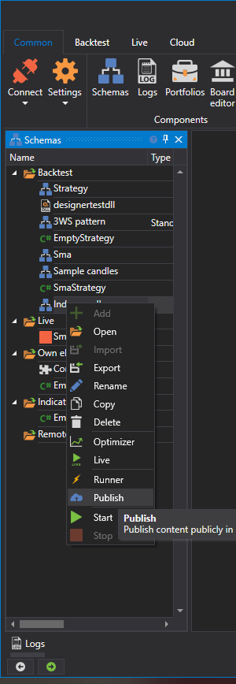

# ストラテジーの公開

[スキームパネル](../user_interface/schemas.md) パネルでストラテジーをマウスの左ボタンでクリックし、**公開** を選択することで、ストラテジーを公開できます:

**公開** ボタンをクリックすると、エクスポート種類を選択するウィンドウが開きます。詳細については、[ストラテジーのエクスポート](../export_import/export.md) セクションを参照してください。

エクスポート種類を選択すると、公開パラメーターを使用して [インストーラー](../../installer.md) プログラムが起動されます（[インストーラー](../../installer.md) は事前に起動しておく必要があります）:

入力が必須のフィールド:

- 名前
- 説明
- NuGet パッケージ識別子。 このパラメーターは、ストア内の製品へのリンクを設定するために必要です。たとえば、アドレス https://stocksharp.com/store/runner/ では、**runner** という単語がこのパラメーターを通じて指定されています。

**無料** または **有料** レベルへのアクセスは、メール [info@stocksharp.com](mailto:info@stocksharp.com) で連絡した後にのみ付与されます。既定では **非公開** レベルが使用可能であり、選択したユーザー向けのプライベート形式でのみストラテジーを公開できます:

**保存** ボタンをクリックすると、ストラテジーは StockSharp サーバーに送信されます。

更新を公開する場合、すべてのパラメーターを再度入力する必要はありません。製品パラメーターを入力する代わりに、更新用のノートを入力するウィンドウが表示されます:

**確定** ボタンをクリックすると、更新が成功したことを示すウィンドウが表示されます:

