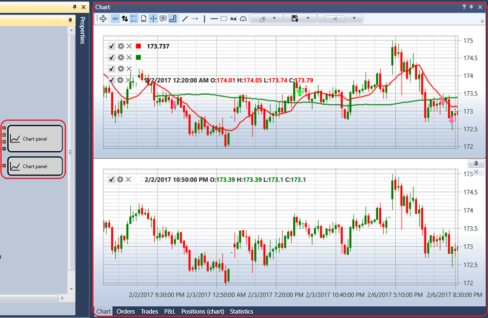

# チャート

**Chart** コンポーネントには、ストラテジー内にあるすべての **Chart panel** キューブが含まれます。たとえば、ストラテジーが 2 つの **Chart panel** キューブを使用している場合、図のように **Chart** コンポーネントには 2 つのチャートが表示されます。

各チャートの左上隅には、チャートに追加されたすべてのグラフィック要素が表示されます。グラフィック要素の  チェックボックスをオフにすると、その要素はチャートから削除されます。 ボタンをクリックすると、グラフィック要素の設定が開きます。また、[Chart](../../strategies/using_visual_designer/elements/common/chart.md) キューブのプロパティでもグラフィック要素を設定できます。

グラフィック要素の設定では、必要なチャートスタイル（ローソク足、バー、ボックスチャート、クラスタープロファイルなど）を設定できます。

ボックスチャートでは、ローソク足をさらにグループ化できます。グループ化順序は、第 2 時間枠の乗数、第 3 時間枠の乗数の各フィールドで設定します。

チャートの上にはツールバーがあり、自動スクロール、自動ズーム、凡例モード、その他の一般的なチャート設定を選択できます。また、チャート上に描画する要素（線、レベル、ポインター、四角形、テキスト）も選択できます。

## 推奨コンテンツ

[注文](orders.md)
