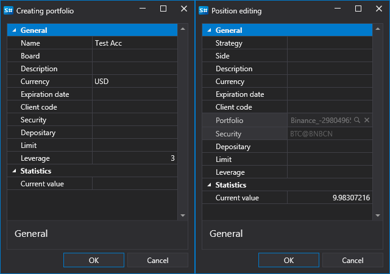

# ポートフォリオ

ポートフォリオを操作するために **ポートフォリオ** パネルがあります。**共通** タブの **ポートフォリオ** ボタンをクリックすると開くことができます。

**ポートフォリオ** パネルは、ポートフォリオの基本データと、それらのポートフォリオの現在ポジションを表示するテーブルです。ポートフォリオまたはポジションをダブルクリックすると、**ポートフォリオ作成** ウィンドウまたは **ポジション作成** ウィンドウが表示され、選択したポートフォリオまたはポジションを編集できます。新しいポートフォリオまたは新しいポジションを作成するには、 ボタンをクリックし、ドロップダウン メニューで該当する項目を選択する必要があります。

 ボタンをクリックすると、[通知設定](../../terminal/notifications.md) ウィンドウが開きます。

## 推奨コンテンツ

[ストラテジー ギャラリー](../strategy_gallery.md)
