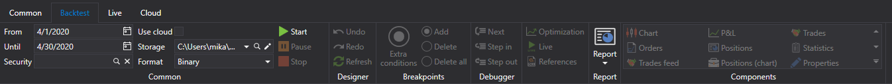
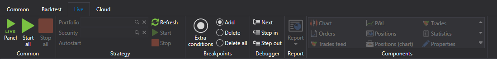

# リボン

[Designer](../../designer.md) の主なユーザー インターフェイス要素は、アプリケーション ウィンドウの上部に沿って配置される **リボン** です。リボンを使用すると、必要なコマンドにすばやくアクセスできます。コマンドは論理的なグループに整理され、タブにまとめられています。目的のタブに移動するには、そのタイトル (名前) をクリックするだけです。各タブは、実行されるアクションの種類に対応しています。

1. **共通** タブは起動後に既定で開き、作業の初期段階で必要になる可能性のある要素が含まれています。**共通** タブから、[接続設定](../connections_settings.md)、[スキームパネル](schemas.md)、[ログパネル](logs.md)、[ポートフォリオ](portfolios.md)、[ボードエディター](boards.md)、[履歴データリポジトリの作成](../market_data_storage/getting_started.md)を開くことができます。また、**共通** タブでは、ストラテジーの追加、開く、削除、インポート、エクスポートができます。自分のストラテジーをコミュニティと共有したい場合は、*公開* ボタンをクリックして行えます。隣のボタンである *利用可能なストラテジー* は、自分や他のユーザーが公開したアルゴリズムを開きます。右側には、ヘルプの呼び出しや問い合わせ用のサービス ボタンがあります。問題を報告したり、Telegram チャットで問い合わせたりできます。

2. **バックテスト** タブは、[スキーム](schemas.md) パネルでストラテジーを選択すると自動的に開きます。**バックテスト** タブには、ストラテジーの作成、デバッグ、テスト、最適化のための主要な要素が含まれています ([ストラテジーの作成](../strategies/using_visual_designer.md)、[バックテストの例](../backtesting/getting_started.md))。また、このタブでは、実取引向けにストラテジーを起動し、チャート、板情報、約定など、ストラテジーに必要なコンポーネントを選択します。

3. **ライブ** タブは、特に実取引用です。接続設定の詳細は、[接続設定](../connections_settings.md)に記載されています。[Designer](../../designer.md) を使用した実取引については、[実取引](../live_execution/getting_started.md)で説明されています。

4. **クラウド** タブ。[Designer](../../designer.md) はクラウド サービスと連携するように設計されています。完了した *Cloud Tasks* の表示、Cloud で利用可能な銘柄に関する情報の取得、チャネルおよびロボットを使用したリモート作業の設定ができます。

## 関連項目

[ワークスペース](workspace.md)
