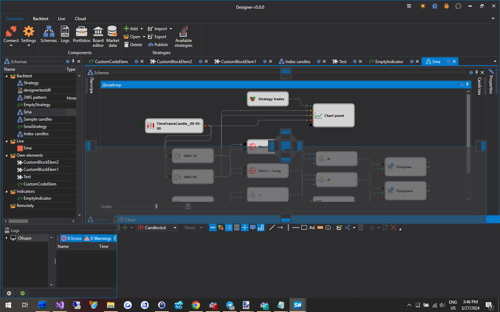

# ワークスペース

[Designer](../../designer.md) の **ワークスペース** は、Microsoft Visual Studio で使用されているものに似たパネル ドッキングを備えたウィンドウ インターフェイスです。パネルのヘッダーをマウスの左ボタンでクリックして押したままにすると、パネルを便利な場所に固定できます。パネルの端をドラッグすると、高さまたは幅を調整できます。

## 推奨コンテンツ

[スキーム](schemas.md)

