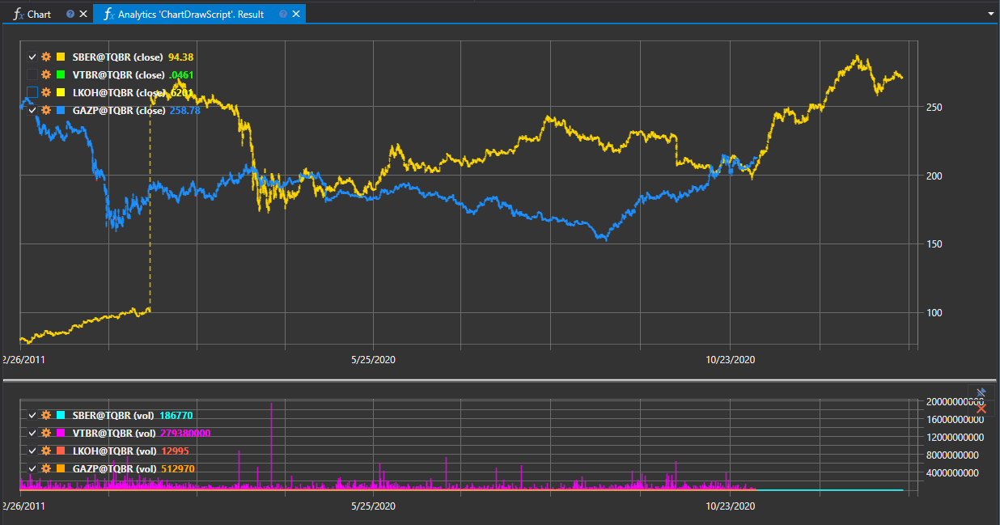

# スクリプトの作成

**Analytics** では、独自のスクリプトを作成できます。例として、チャート描画の機能を示す **ChartDrawScript** を確認しましょう。

```cs
namespace StockSharp.Algo.Analytics
{
	/// <summary>
	/// 分析スクリプト。チャート描画の可能性を示します。
	/// </summary>
	public class ChartDrawScript : IAnalyticsScript
	{
		Task IAnalyticsScript.Run(ILogReceiver logs, IAnalyticsPanel panel, SecurityId[] securities, DateTime from, DateTime to, IStorageRegistry storage, IMarketDataDrive drive, StorageFormats format, DataType dataType, CancellationToken cancellationToken)
		{
			if (securities.Length == 0)
			{
				logs.LogWarning("No instruments.");
				return Task.CompletedTask;
			}

			var lineChart = panel.CreateChart<DateTimeOffset, decimal>();
			var histogramChart = panel.CreateChart<DateTimeOffset, decimal>();

			foreach (var security in securities)
			{
				// ユーザーがスクリプト実行をキャンセルした場合は計算を停止する
				if (cancellationToken.IsCancellationRequested)
					break;

				var candlesSeries = new Dictionary<DateTimeOffset, decimal>();
				var volsSeries = new Dictionary<DateTimeOffset, decimal>();

				// ローソク足ストレージを取得
				var candleStorage = storage.GetCandleMessageStorage(security, dataType, drive, format);

				foreach (var candle in candleStorage.Load(from, to))
				{
					// 系列を埋める
					candlesSeries[candle.OpenTime] = candle.ClosePrice;
					volsSeries[candle.OpenTime] = candle.TotalVolume;
				}

				// 系列をラインおよびヒストグラムとしてチャートに描画
				lineChart.Append($"{security} (close)", candlesSeries.Keys, candlesSeries.Values, DrawStyles.DashedLine);
				histogramChart.Append($"{security} (vol)", volsSeries.Keys, volsSeries.Values, DrawStyles.Histogram);
			}

			return Task.CompletedTask;
		}
	}
}

```

## 概要

このスクリプトは、特定の期間における金融商品の価格データと出来高データに基づいてチャートを描画するように設計されています。[IAnalyticsScript](xref:StockSharp.Algo.Analytics.IAnalyticsScript) インターフェイスを実装しており、これは **Hydra** プログラムで実行できる任意の分析スクリプトの契約を定義します。

## `IAnalyticsScript` インターフェイス

[IAnalyticsScript](xref:StockSharp.Algo.Analytics.IAnalyticsScript) インターフェイスは、実装するすべての分析スクリプトが [Run](xref:StockSharp.Algo.Analytics.IAnalyticsScript.Run(Ecng.Logging.ILogReceiver,StockSharp.Algo.Analytics.IAnalyticsPanel,StockSharp.Messages.SecurityId[],System.DateTime,System.DateTime,StockSharp.Algo.Storages.IStorageRegistry,StockSharp.Algo.Storages.IMarketDataDrive,StockSharp.Algo.Storages.StorageFormats,StockSharp.Messages.DataType,System.Threading.CancellationToken)) メソッドを持つことを保証します。このメソッドは、スクリプトの分析処理を実行するために必要です。

### `Run` メソッド

[Run](xref:StockSharp.Algo.Analytics.IAnalyticsScript.Run(Ecng.Logging.ILogReceiver,StockSharp.Algo.Analytics.IAnalyticsPanel,StockSharp.Messages.SecurityId[],System.DateTime,System.DateTime,StockSharp.Algo.Storages.IStorageRegistry,StockSharp.Algo.Storages.IMarketDataDrive,StockSharp.Algo.Storages.StorageFormats,StockSharp.Messages.DataType,System.Threading.CancellationToken)) メソッドは分析スクリプトのエントリーポイントであり、実際のデータ処理と分析操作が実行される場所です。

#### パラメーター:

- `logs`: スクリプト内のログ記録に使用する [ILogReceiver](xref:Ecng.Logging.ILogReceiver) のインスタンスを受け取ります。
- `panel`: チャートの描画と結果の表示に使用するユーザーインターフェイス要素である [IAnalyticsPanel](xref:StockSharp.Algo.Analytics.IAnalyticsPanel) を提供します。
- `securities`: 分析対象の金融商品を識別する [SecurityId](xref:StockSharp.Messages.SecurityId) の配列です。
- `from`: 分析対象データ範囲の開始日です。
- `to`: 分析対象データ範囲の終了日です。
- `storage`: マーケットデータストレージへのアクセスを可能にする [IStorageRegistry](xref:StockSharp.Algo.Storages.IStorageRegistry) のインスタンスです。
- `drive`: マーケットデータストレージの場所を指定する [IMarketDataDrive](xref:StockSharp.Algo.Storages.IMarketDataDrive) を表します。
- `format`: マーケットデータ形式を示す [StorageFormats](xref:StockSharp.Algo.Storages.StorageFormats) 値です。
- `dataType`: 要求されたマーケットデータ型とそのパラメーター (たとえばローソク足の時間枠) を説明する [DataType](xref:StockSharp.Messages.DataType) です。
- `cancellationToken`: キャンセル要求を監視する [CancellationToken](xref:System.Threading.CancellationToken) です。

#### 戻り値:

- [Task](xref:System.Threading.Tasks.Task)。分析スクリプトの非同期操作を表します。

## 実装の詳細

`ChartDrawScript` クラスは、提供された各証券のマーケットデータを具体的に処理します。終値用のラインチャートと、出来高データ用のヒストグラムという 2 種類のチャートを作成します。

### 主な処理段階:

1. 処理する銘柄が存在するか確認します。利用可能なものがない場合は警告をログに記録し、タスクを完了します。
2. [IAnalyticsPanel.CreateChart](xref:StockSharp.Algo.Analytics.IAnalyticsPanel.CreateChart``2) メソッドを使用して、ラインチャートとヒストグラムを作成します。
3. 各証券を反復処理し、キャンセル要求を確認します。
4. `storage.GetCandleMessageStorage` メソッドを使用してローソク足ストレージを取得します。
5. 指定された日付範囲内のローソク足データを読み込みます。
6. 始値時刻の時系列データ、対応する終値、合計出来高を辞書に格納します。
7. `lineChart.Append` メソッドと `histogramChart.Append` メソッドを使用して、系列データをチャートに描画します。

このスクリプトは、ラインチャート用の [DrawStyles.DashedLine](xref:Ecng.Drawing.DrawStyles.DashedLine) やヒストグラム用の [DrawStyles.Histogram](xref:Ecng.Drawing.DrawStyles.Histogram) などのスタイルを使用し、異なるデータ表現を視覚的に区別します。

[IAnalyticsScript](xref:StockSharp.Algo.Analytics.IAnalyticsScript) を実装することで、`ChartDrawScript` クラスはカスタマイズ可能な分析スクリプトを実行するアプローチを統合できるようにし、StockSharp プラットフォームを使用するトレーダーやアナリストにとって汎用性の高いツールになります。

## 実行結果


