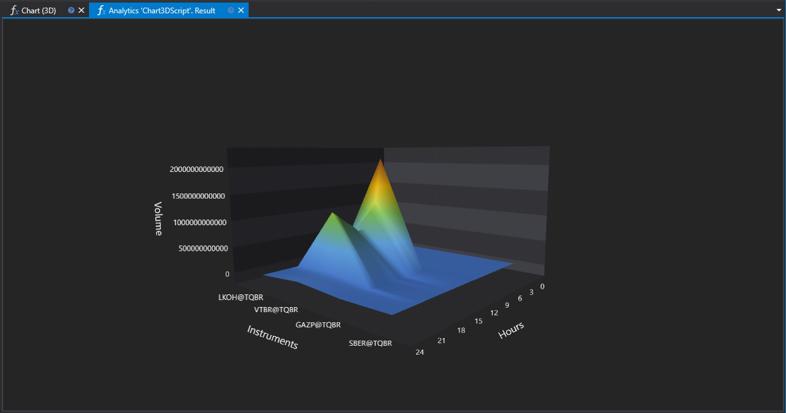

# 3D チャート

`Chart3DScript` スクリプトは、さまざまな金融商品の時間帯別取引出来高の分布を可視化する 3D チャートの作成を示します。この可視化方法により、取引動向を明確に表現し、市場活動のピークを識別できます。



## スクリプト動作の説明

このスクリプトは、指定された期間のローソク足データを分析し、時間単位でグループ化して、各時間の合計取引出来高を計算します。結果は 3D チャートで表示され、各軸は次を表します。

- **X 軸**: 金融商品。
- **Y 軸**: 取引セッションの時間 (0 から 23)。
- **Z 軸**: 取引出来高。

## 3D チャートを使用する有用性

### 市場活動の分析

3D チャートにより、複数の銘柄で最大の活動がいつ発生するかを同時に評価できます。これは、最適な取引時間帯の特定や、グローバルイベントが市場に与える影響の調査に役立ちます。

### 銘柄の比較

時間帯別の取引出来高を 3 次元空間で可視化することで、トレーダーは活動水準や好まれる取引時間の観点から銘柄同士を比較できます。これは、特定の時間帯に最も流動性の高い銘柄を選択したり、ポートフォリオ分散のために類似した活動パターンを持つ銘柄を見つけたりするのに役立ちます。

### 戦略の最適化

取引出来高の分布を分析することは、市場活動が最も高い時間枠に適応できるようにする取引戦略最適化の基礎となります。これは、アルゴリズム取引や高頻度取引に特に関連します。

## スクリプトの実装

このスクリプトは次の処理を実行します。

1. 分析対象の金融商品が存在するか確認します。
2. X 軸 (銘柄) と Y 軸 (時間) のラベルを作成します。
3. ローソク足データを読み込み、グループ化します。
4. 時間別の合計取引出来高を計算し、Z 軸のデータを埋めます。
5. `panel.Draw3D` メソッドを使用して 3D チャートを描画します。

## C# のスクリプトコード

```cs
namespace StockSharp.Algo.Analytics
{
	/// <summary>
	/// 分析スクリプト。時間別の最大出来高の分布を計算し、
	/// 3D チャートに表示します。
	/// </summary>
	public class Chart3DScript : IAnalyticsScript
	{
		Task IAnalyticsScript.Run(ILogReceiver logs, IAnalyticsPanel panel, SecurityId[] securities, DateTime from, DateTime to, IStorageRegistry storage, IMarketDataDrive drive, StorageFormats format, DataType dataType, CancellationToken cancellationToken)
		{
			if (securities.Length == 0)
			{
				logs.LogWarning("No instruments.");
				return Task.CompletedTask;
			}

			var x = new List<string>();
			var y = new List<string>();

			// Y ラベルを埋める
			for (var h = 0; h < 24; h++)
				y.Add(h.ToString());

			var z = new double[securities.Length, y.Count];

			for (var i = 0; i < securities.Length; i++)
			{
				// ユーザーがスクリプト実行をキャンセルした場合は計算を停止する
				if (cancellationToken.IsCancellationRequested)
					break;

				var security = securities[i];

				// X ラベルを埋める
				x.Add(security.ToStringId());

				// ローソク足ストレージを取得
				var candleStorage = storage.GetCandleMessageStorage(security, dataType, drive, format);

				// 指定された期間で利用可能な日付を取得
				var dates = candleStorage.GetDates(from, to).ToArray();

				if (dates.Length == 0)
				{
					logs.LogWarning("no data");
					return Task.CompletedTask;
				}

				// 始値時刻 (時刻部分のみ) でローソク足をグループ化し、1 時間に切り詰める
				var byHours = candleStorage.Load(from, to)
					.GroupBy(c => c.OpenTime.TimeOfDay.Truncate(TimeSpan.FromHours(1)))
					.ToDictionary(g => g.Key.Hours, g => g.Sum(c => c.TotalVolume));

				// Z 値を埋める
				foreach (var pair in byHours)
					z[i, pair.Key] = (double)pair.Value;
			}

			panel.Draw3D(x, y, z, "Instruments", "Hours", "Volume");

			return Task.CompletedTask;
		}
	}
}

```

## Python のスクリプトコード

```python
import clr

# .NET 参照を追加
clr.AddReference("StockSharp.Messages")
clr.AddReference("StockSharp.Algo.Analytics")
clr.AddReference("Ecng.Drawing")

from Ecng.Drawing import DrawStyles
from System.Threading.Tasks import Task
from StockSharp.Algo.Analytics import IAnalyticsScript
from storage_extensions import *
from candle_extensions import *
from chart_extensions import *
from numpy_extensions import nx

# 分析スクリプト。時間別の最大出来高の分布を計算し、3D チャートに表示します。
class chart3d_script(IAnalyticsScript):
	def Run(
		self,
		logs,
		panel,
		securities,
		from_date,
		to_date,
		storage,
		drive,
		format,
		data_type,
		cancellation_token
	):
		# 銘柄がないか確認
		if not securities:
			logs.LogWarning("No instruments.")
			return Task.CompletedTask

		x = []  # 銘柄の X ラベル
		y = []  # 時間の Y ラベル

		# Y ラベルに 0 から 23 までの時間を埋める
		for h in range(24):
			y.append(str(h))

		# 次元が (証券数) x (時間数) の Z 値用 2D 配列を作成
		z = [[0.0 for _ in range(len(y))] for _ in range(len(securities))]

		if data_type is None:
			logs.LogWarning(f"サポートされていないデータ型 {data_type}。")
			return Task.CompletedTask

		message_type = data_type.MessageType

		for i, security in enumerate(securities):
			# ユーザーがスクリプト実行をキャンセルした場合は計算を停止
			if cancellation_token.IsCancellationRequested:
				break

			# X ラベルに証券識別子を埋める
			x.append(to_string_id(security))

			# 現在の証券のローソク足ストレージを取得
			candle_storage = get_candle_storage(storage, security, data_type, drive, format)

			# 指定された期間で利用可能な日付を取得
			dates = get_dates(candle_storage, from_date, to_date)

			if len(dates) == 0:
				logs.LogWarning("no data")
				return Task.CompletedTask

			# 始値時刻 (直近の時間に切り詰め) でローソク足をグループ化し、出来高を合計
			candles = load_range(candle_storage, message_type, from_date, to_date)
			by_hours = {}
			for candle in candles:
				hour = int(candle.OpenTime.TimeOfDay.TotalHours)
				by_hours[hour] = by_hours.get(hour, 0) + candle.TotalVolume

			# 現在の証券の Z 値を埋める
			for hour, volume in by_hours.items():
				if hour < len(y):
					z[i][hour] = float(volume)

		# panel を使用して 3D チャートを描画
		panel.Draw3D(x, y, nx.to2darray(z), "Instruments", "Hours", "Volume")

		return Task.CompletedTask

```
