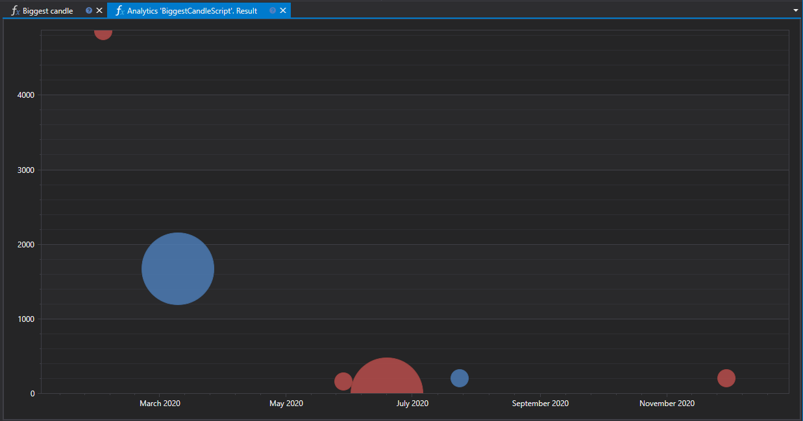

# 最大ローソク足

"最大ローソク足" スクリプトは、選択された金融商品のチャート上で、指定された期間における最大出来高と最大の実体長を持つローソク足を識別するように設計されています。このツールにより、トレーダーやアナリストは重要な市場イベントと市場参加者の反応を識別できます。



## 主な機能

このスクリプトは指定された銘柄のセットを分析し、その中から最大の出来高と実体長を持つローソク足を検索し、このデータを 2 つのグラフに表示します。

- **ローソク足実体長チャート**: 始値と終値の差が最も大きいローソク足を示します。
- **取引出来高チャート**: ローソク足の存続時間における最大取引出来高のローソク足を示します。

## ワークフロー

1. **銘柄と分析期間の選択**: 分析対象の銘柄リストと時間間隔を決定します。
2. **データ分析**: 最大の指標を持つローソク足を識別するために、履歴ローソク足データの読み込みと分析を行います。
3. **結果の可視化**: 検出されたローソク足は、分析パネルのインターフェイス内のチャートに表示されます。

## 応用

- **市場活動の分析**: トレーダーの活動が最も高い瞬間や、潜在的な市場反転を判断するのに役立ちます。
- **重要水準の識別**: 大きな出来高と実体長を持つローソク足は、多くの場合、主要なサポートおよびレジスタンス水準の周辺で形成されます。
- **戦略的計画**: 最大ローソク足に関する情報は、潜在的なボラティリティを考慮して、市場へのエントリーポイントとエグジットポイントを計画するために使用できます。

## C# のスクリプトコード

```cs
namespace StockSharp.Algo.Analytics
{
	/// <summary>
	/// 分析スクリプト。指定された証券について最大のローソク足 (出来高および長さ) を表示します。
	/// </summary>
	public class BiggestCandleScript : IAnalyticsScript
	{
		Task IAnalyticsScript.Run(ILogReceiver logs, IAnalyticsPanel panel, SecurityId[] securities, DateTime from, DateTime to, IStorageRegistry storage, IMarketDataDrive drive, StorageFormats format, DataType dataType, CancellationToken cancellationToken)
		{
			if (securities.Length == 0)
			{
				logs.LogWarning("銘柄がありません。");
				return Task.CompletedTask;
			}

			var priceChart = panel.CreateChart<DateTimeOffset, decimal, decimal>();
			var volChart = panel.CreateChart<DateTimeOffset, decimal, decimal>();

			var bigPriceCandles = new List<CandleMessage>();
			var bigVolCandles = new List<CandleMessage>();

			foreach (var security in securities)
			{
				// ユーザーがスクリプト実行をキャンセルした場合は計算を停止する
				if (cancellationToken.IsCancellationRequested)
					break;

				// ローソク足ストレージを取得
				var candleStorage = storage.GetCandleMessageStorage(security, dataType, drive, format);

				var allCandles = candleStorage.Load(from, to).ToArray();

				// 出来高の降順で最初に並ぶものが最大のローソク足になります
				var bigPriceCandle = allCandles.OrderByDescending(c => c.GetLength()).FirstOrDefault();
				var bigVolCandle = allCandles.OrderByDescending(c => c.TotalVolume).FirstOrDefault();

				if (bigPriceCandle != null)
					bigPriceCandles.Add(bigPriceCandle);

				if (bigVolCandle != null)
					bigVolCandles.Add(bigVolCandle);
			}

			// 系列をチャートに描画
			priceChart.Append("価格", bigPriceCandles.Select(c => c.OpenTime), bigPriceCandles.Select(c => c.GetMiddlePrice(null)), bigPriceCandles.Select(c => c.GetLength()));
			volChart.Append("価格", bigVolCandles.Select(c => c.OpenTime), bigPriceCandles.Select(c => c.GetMiddlePrice(null)), bigVolCandles.Select(c => c.TotalVolume));

			return Task.CompletedTask;
		}
	}
}

```

## Python のスクリプトコード

```python
import clr

# .NET 参照を追加
clr.AddReference("StockSharp.Messages")
clr.AddReference("StockSharp.Algo.Analytics")
clr.AddReference("Ecng.Drawing")

from Ecng.Drawing import DrawStyles
from System.Threading.Tasks import Task
from StockSharp.Algo.Analytics import IAnalyticsScript
from storage_extensions import *
from candle_extensions import *
from chart_extensions import *
from indicator_extensions import *

# 分析スクリプト。指定された証券について最大のローソク足 (出来高および長さ) を表示します。
class biggest_candle_script(IAnalyticsScript):
	def Run(self, logs, panel, securities, from_date, to_date, storage, drive, format, data_type, cancellation_token):
		if not securities:
			logs.LogWarning("銘柄がありません。")
			return Task.CompletedTask

		price_chart = create_3d_chart(panel, datetime, float, float)
		vol_chart = create_3d_chart(panel, datetime, float, float)

		big_price_candles = []
		big_vol_candles = []

		if data_type is None:
			logs.LogWarning(f"サポートされていないデータ型 {data_type}。")
			return Task.CompletedTask

		message_type = data_type.MessageType

		for security in securities:
			# ユーザーがスクリプト実行をキャンセルした場合は計算を停止する
			if cancellation_token.IsCancellationRequested:
				break

			# ローソク足ストレージを取得
			candle_storage = get_candle_storage(storage, security, data_type, drive, format)
			all_candles = load_range(candle_storage, message_type, from_date, to_date)

			if len(all_candles) > 0:
				# 出来高の降順で最初に並ぶものが最大のローソク足になります
				big_price_candle = max(all_candles, key=lambda c: get_length(c))
				big_vol_candle = max(all_candles, key=lambda c: c.TotalVolume)

				if big_price_candle is not None:
					big_price_candles.append(big_price_candle)

				if big_vol_candle is not None:
					big_vol_candles.append(big_vol_candle)

		# 系列をチャートに描画
		price_chart.Append(
			"価格",
			[c.OpenTime for c in big_price_candles],
			[get_middle_price(c) for c in big_price_candles],
			[get_length(c) for c in big_price_candles]
		)

		vol_chart.Append(
			"価格",
			[c.OpenTime for c in big_vol_candles],
			[get_middle_price(c) for c in big_price_candles],
			[c.TotalVolume for c in big_vol_candles]
		)

		return Task.CompletedTask

```
