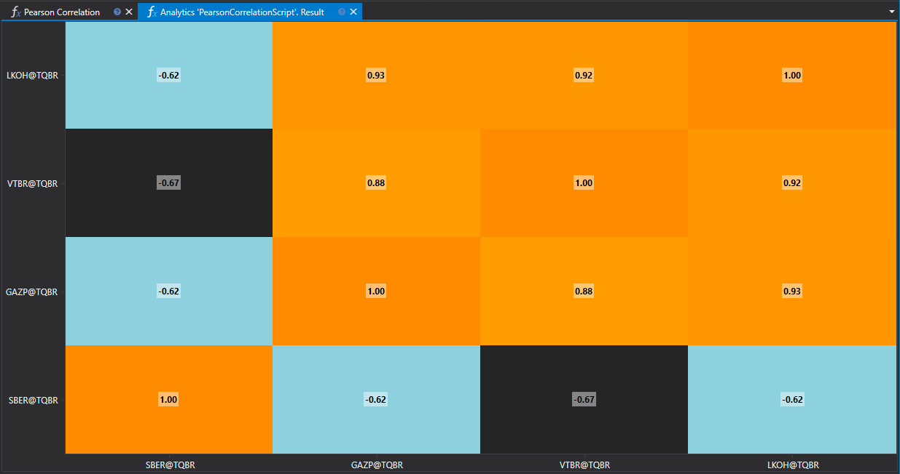

# ピアソン相関

ピアソン相関は、2 つの量的変数の間にある線形関係の程度を測定するために使用される統計手法です。金融分析では、この手法は株式や通貨ペアなど、異なる資産間の関係を調査するために広く利用されています。



## 手法の説明

ピアソン相関係数は -1 から 1 の範囲を取り、次を意味します。

- **1** は完全な正の相関を示します。
- **0** は線形関係がないことを示唆します。
- **-1** は完全な負の相関を示します。

係数の値は、2 つの変数が線形にどれほど密接に関連しているかを示します。

## 実務での応用

- **ポートフォリオ管理**: 資産間の相関を評価することは、リスクを最小化する分散ポートフォリオの構築に役立ちます。
- **ヘッジ戦略**: 高い負の相関を持つ資産の識別は、ヘッジ戦略の開発に使用できます。
- **市場トレンド分析**: 異なる市場や銘柄間の相関を研究することで、世界経済の相互関係に関する洞察が得られます。

## ピアソン相関の計算

ピアソン相関係数は次の式で計算されます。

\[ r = \frac{n(\sum xy) - (\sum x)(\sum y)}{\sqrt{[n\sum x^2 - (\sum x)^2][n\sum y^2 - (\sum y)^2]}} \]

ここで:
- \(n\) は観測数です。
- \(x\) と \(y\) は変数の値です。
- \(\sum\) は総和を表します。

## スクリプトの実装

ピアソン相関を計算するスクリプトには、次の手順を含める必要があります。

1. **データ収集**: 分析対象となる 2 つの変数の時系列を読み込みます。
2. **予備処理**: 時系列を日付で整列し、欠損値を削除します。
3. **計算**: 処理済みデータにピアソン相関の式を適用します。
4. **結果分析**: 意思決定のために、得られた相関係数を解釈します。

ピアソン相関を計算することで、市場分析と投資戦略の最適化に重要な情報が得られ、金融資産間の相互影響の程度を評価できます。

## C# のスクリプトコード

```cs
namespace StockSharp.Algo.Analytics
{
	using MathNet.Numerics.Statistics;

	/// <summary>
	/// 分析スクリプト。指定された証券でピアソン相関を計算します。
	/// </summary>
	public class PearsonCorrelationScript : IAnalyticsScript
	{
		Task IAnalyticsScript.Run(ILogReceiver logs, IAnalyticsPanel panel, SecurityId[] securities, DateTime from, DateTime to, IStorageRegistry storage, IMarketDataDrive drive, StorageFormats format, DataType dataType, CancellationToken cancellationToken)
		{
			if (securities.Length == 0)
			{
				logs.LogWarning("No instruments.");
				return Task.CompletedTask;
			}

			var closes = new List<double[]>();

			foreach (var security in securities)
			{
				// ユーザーがスクリプト実行をキャンセルした場合は計算を停止する
				if (cancellationToken.IsCancellationRequested)
					break;

				// ローソク足ストレージを取得
				var candleStorage = storage.GetCandleMessageStorage(security, dataType, drive, format);

				// 終値を取得
				var prices = candleStorage.Load(from, to).Select(c => (double)c.ClosePrice).ToArray();

				if (prices.Length == 0)
				{
					logs.LogWarning("No data for {0}", security);
					return Task.CompletedTask;
				}

				closes.Add(prices);
			}

			// すべての配列は同じ長さである必要があるため、長いものを切り詰めます
			var min = closes.Select(arr => arr.Length).Min();

			for (var i = 0; i < closes.Count; i++)
			{
				var arr = closes[i];

				if (arr.Length > min)
					closes[i] = arr.Take(min).ToArray();
			}

			// 相関を計算
			var matrix = Correlation.PearsonMatrix(closes);

			// 結果をヒートマップに表示
			var ids = securities.Select(s => s.ToStringId());
			panel.DrawHeatmap(ids, ids, matrix.ToArray());

			return Task.CompletedTask;
		}
	}
}

```

## Python のスクリプトコード

```python
import clr

# .NET 参照を追加
clr.AddReference("StockSharp.Messages")
clr.AddReference("StockSharp.Algo.Analytics")
clr.AddReference("Ecng.Drawing")

from Ecng.Drawing import DrawStyles
from System.Threading.Tasks import Task
from StockSharp.Algo.Analytics import IAnalyticsScript
from storage_extensions import *
from candle_extensions import *
from chart_extensions import *
from indicator_extensions import *
from numpy_extensions import nx

clr.AddReference("NumpyDotNet")
from NumpyDotNet import np

# 分析スクリプト。指定された証券でピアソン相関を計算します。
class pearson_correlation_script(IAnalyticsScript):
	def Run(
		self,
		logs,
		panel,
		securities,
		from_date,
		to_date,
		storage,
		drive,
		format,
		data_type,
		cancellation_token
	):
		if not securities:
			logs.LogWarning("No instruments.")
			return Task.CompletedTask

		closes = []

		if data_type is None:
			logs.LogWarning(f"Unsupported data type {data_type}.")
			return Task.CompletedTask

		message_type = data_type.MessageType

		for security in securities:
			# ユーザーがスクリプト実行をキャンセルした場合は計算を停止する
			if cancellation_token.IsCancellationRequested:
				break

			# ローソク足ストレージを取得
			candle_storage = get_candle_storage(storage, security, data_type, drive, format)

			# 終値を取得
			prices = [float(c.ClosePrice) for c in load_range(candle_storage, message_type, from_date, to_date)]

			if len(prices) == 0:
				logs.LogWarning("No data for {0}", security)
				return Task.CompletedTask

			closes.append(prices)

		# すべての配列は同じ長さである必要があるため、長いものを切り詰めます
		min_length = min(len(arr) for arr in closes)
		closes = [arr[:min_length] for arr in closes]

		# リストまたは配列を 2D 配列に変換
		array2d = nx.to2darray(closes)

		# NumSharp を使用して相関を計算
		np_array = np.array(array2d)
		matrix = np.corrcoef(np_array)

		# 結果をヒートマップに表示
		ids = [to_string_id(s) for s in securities]
		panel.DrawHeatmap(ids, ids, nx.tosystemarray(matrix))

		return Task.CompletedTask

```
