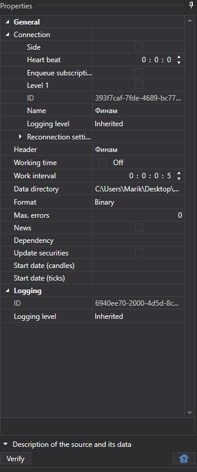

# 共通接続設定

すべてのソースに共通する接続プロパティです。

**Connection**

- **Connection** - 接続設定。
- **Title** - タスクのタイトル。
- **Start date (ticks)** - データのダウンロードを開始する日付。
- **Work from** - 開始時刻。
- **Work until** - 終了時刻。
- **Interval of work** - 動作間隔。
- **Data directory** - StockSharp 形式の最終ファイルを保存するデータ ディレクトリ。
- **Format** - データ形式: BIN\/CSV。
- **Max. errors** - タスクを停止するまでの最大エラー数。既定値は 0 で、エラー数を無視することを意味します。
- **News** - ニュースをダウンロードします。
- **Dependency** - 現在のタスクを開始する前に完了している必要があるタスク。
- **Update securities** - 接続時に銘柄を更新します。
