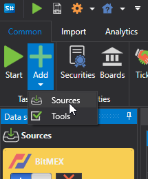

# ソースの選択

新しいマーケット データ ソースを追加するには、次の操作を行う必要があります。

- **共通** タブに移動する
- **追加** を選択する
- **Sources** を選択する

すると、ソースの一覧が表示されます。ユーザーは複数のソースを同時に選択できます。

同じソースのインスタンスを複数作成することもできます。たとえば、ダウンロードしたデータを別々のフォルダーに保存する **Interactive Brokers** のインスタンスを複数作成できます。

**開始** ボタンをクリックした後にソースがデータのダウンロードを開始するには、そのソースを有効にしておく必要があります。これを行うには、左側パネルでソース アイコンを選択し、 ボタンを使用してオンまたはオフを切り替えます。この操作は、ダウンロード対象の銘柄を追加する前でも後でも実行できます。

不要なソースは  ボタンで削除できます。

ソース設定は、右側の **プロパティ** パネルで変更できます。

すべてのソースに共通する設定は、[共通接続設定](common_connection_settings.md) の項目にあります。

各接続には固有の特性があります。[コネクタ一覧](../data_sources.md) のリンクには、コネクタとその設定の一覧が示されています。

**[ビデオ チュートリアル](../videos/sources_samples.md)を見る**
