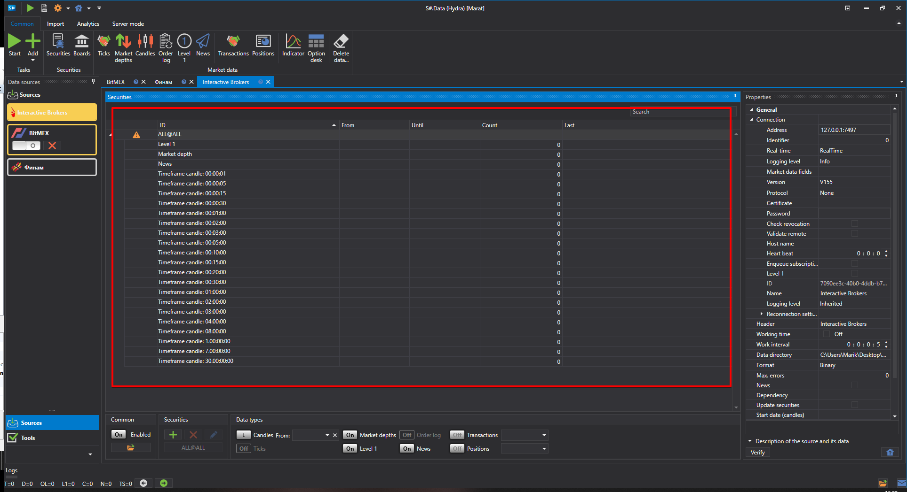
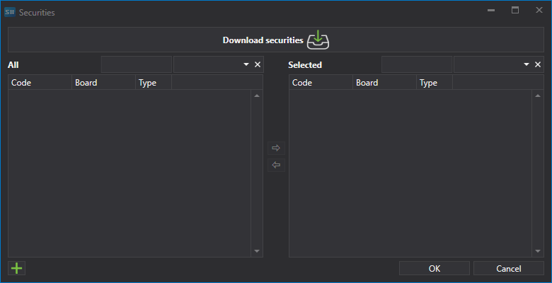
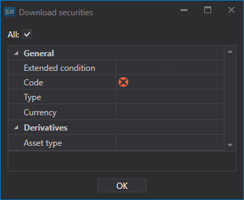
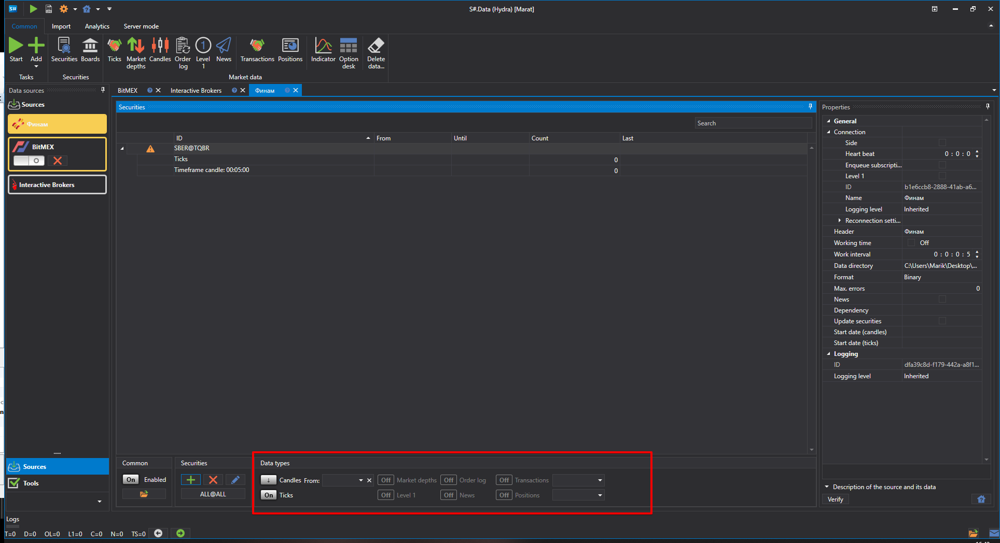
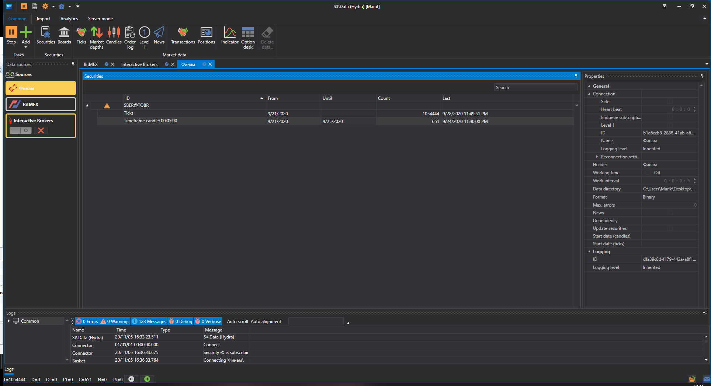

# 初回起動

初めて実行すると、データ ソースを選択するための次のウィンドウが表示されます。このウィンドウは、**共通** タブで **追加 \=\> ソース** を選択して開くこともできます。

ウィンドウで必要なソースにチェックを付けます。地域、ボード、データ型、支払い、リアルタイムかどうかでフィルターを使用できます。選択が完了したら、**OK** をクリックします。その後、プログラムはユーティリティを有効にするかどうかを提示します。ユーティリティの操作の詳細については、[ユーティリティ](tasks.md) セクションを参照してください。**OK** をクリックします。

その後、ソースがメイン アプリケーション ウィンドウの左側パネルに追加されます。

## マーケット データをアップロードするためのツールのダウンロード:

マーケット データのダウンロードを開始する前に、マーケット データを取得する銘柄を設定する必要があります。

マーケット データ ソースを追加すると、追加されたソースのパネルが中央部分に開かれ、銘柄一覧が表示されます。パネルが閉じている場合は、プログラム左側の一覧でソース ロゴをダブルクリックすると開くことができます。

たとえば、サポートされているデータ ソースから AAPL@NASDAQ 銘柄をダウンロードします。

> [!TIP]
> 重要\! データは、銘柄一覧に追加された銘柄についてのみダウンロードされます

1. 銘柄の追加。

   初回起動時、プログラムは選択されたソースについてすべての銘柄を一度にダウンロードすることを提案します。以後、ユーザーは銘柄を自分でダウンロードします。初期状態では、[Hydra](../hydra.md) の銘柄データベースは空で、補助銘柄 **ALL@ALL** だけがあります。この銘柄を選択すると、このソースで利用可能なすべての銘柄についてデータがダウンロードされます。

   銘柄を追加するには、**追加**  ボタンをクリックします。すると、銘柄をダウンロードするためのウィンドウが開きます。

   銘柄をダウンロードするには、対応する **銘柄のダウンロード** ボタンをクリックする必要があります。

   その後、画面にメニューが表示され、ユーザーは **すべての銘柄をダウンロード** を選択できます。

   または、一部のソースでは、ダウンロードする必要がある銘柄を[設定](prepare_for_download/instruments_list.md)できます。

   銘柄を受信すると、ウィンドウは次のようになります。

   追加可能なすべての銘柄が一覧表示されます。すばやく検索するには、該当するフィールドに名前を入力できます。

   銘柄を選択するには、その銘柄をダブルクリックします。すると一覧の右側に移動します。

   その後、テーブルの右側に移動します。

   選択されたインストゥルメントは、ツリー構造のテーブルである **銘柄** テーブルに表示されます。その主な要素は銘柄で、追加要素はその銘柄について受信されるマーケット データ型です。
2. 選択した各銘柄について、ダウンロードに必要なマーケット データ型を選択する必要があります。

   必要な銘柄パラメーターがすべて設定されていない場合、銘柄行の左列に  アイコンが表示されます。

   **Ticks** と **Candles Time Frame 5** をダウンロード対象として選択してみます。

   ソース ウィンドウの下部には、受信するデータとインストゥルメントを設定するためのボタンがあるパネルがあります。

   このパネルでは、次の操作を実行できます。
   - **約定、板情報、ローソク足、注文ログ、Level 1、自己取引** の各ボタンを使用して、受信する情報量を設定します。利用可能なマーケット データ型の一覧は、ソースによって異なります。
   - 読み込むローソク足に必要な Time Frame を指定します。受信するローソク足の Time Frame は、ソースによって異なります。
   - マーケット データをダウンロードするために必要な期間を設定します。期間はマーケット データ ウィンドウで直接設定することもできます。そのためには、期間の開始と終了を選択します。

     ユーザーが期間の終了日を指定しない場合、プログラムは現在の日付で利用可能なすべてのデータをダウンロードします。ソースがマーケット データのリアルタイム送信をサポートしている場合、期間の終了日がないと、マーケット データはリアルタイムでダウンロードされます。

     マーケット データをダウンロードする必要がある期間を設定してみます。
   - マーケット データを何から構築するかを指定します。このパラメーターを指定しない場合、ソースで利用可能なローソク足が受信されます。ユーザーがマーケット データ型を指定した場合、指定されたマーケット データ型からローソク足が構築されます。たとえば、ローソク足は最終約定価格、板スプレッド（通常は Forex 市場向け）、ボラティリティ、または最良価格から構築できます。

     この機能は、ソースがローソク足描画用のデータ受信を許可していない場合に使用すると便利です。この場合、ローソク足は平均化されたデータ値に基づいて描画されます。

     ユーザーは、受信データをカスタマイズするためにローソク足の[カスタム タイプ](prepare_for_download/custom_candles.md)を選択することもできます。
   - 銘柄、マーケット データ型を選択し、期間を設定した後、**開始** ボタンをクリックする必要があります。その後、マーケット データのダウンロードが開始されます。

   作業プロセスは、プログラム下部に固定されている専用の **ログ** タブで確認できます。また、ログはローカル フォルダー内のファイルにも保存されます。

ユーザーは[追加ソース](data_sources/select_source.md)を追加することもできます。

マーケット データのダウンロード後、ユーザーは[マーケット データを表示](working_with_data/view_and_export.md)したり、[ローソク足を描画](working_with_data/candles_generation.md)したり、保存したり、[各種形式でエクスポート](working_with_data/export_data.md)したりできます。

**[ビデオ チュートリアル](videos/first_start.md)を見る**。
