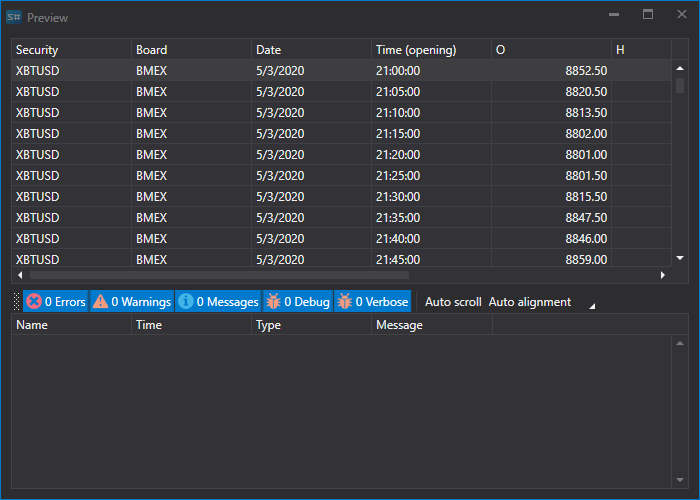

# ローソク足

ローソク足をインポートするには、メイン アプリケーション メニューから **インポート \=\> ローソク足** 項目を選択します。


## ローソク足のインポート プロセス

1. **共通。**
   - **データ型** - インポートするデータの種類。
   - **ファイル名** - CSV ファイルへの完全パス。
   - **データディレクトリ** - 最終的な [S#](../../api.md) ファイルを保存するフォルダー。
   - **ファイルマスク** - ディレクトリをスキャンするときに使用されるファイル マスク。例: candle \_\*.csv。
   - **列区切り文字** - 列区切り文字。タブは TAB と表記されます。
   - **先頭からのスキップ** - スキップするファイル先頭からの行数（メタ情報が含まれている場合）。
   - **タイムゾーン** - タイム ゾーン。
   - **間隔** - データ更新の頻度。

   **銘柄**
   - **拡張情報** - インポートされた拡張フィールドを拡張情報ストレージに保存します
   - **重複** - 重複する銘柄がすでに存在する場合に更新するかどうか。
2. [S#](../../api.md) フィールドのインポート パラメーターを設定します。
   - **S# フィールド** - S# フィールドの値（**銘柄**、**ボード** など）。
   - **関連付け** - ファイル内の列値を stocksharp 型に対応付けます（必要な場合）。
   - **形式** - データ形式。通常は日付と時刻の値をインポートするときに使用します（[約定](ticks.md) を参照）。
   - **使用** - インポート時にデータを使用するかどうか。
   - **フィールド順序** - インポート対象項目のプロパティ列が配置される順序。

     たとえば、インポートするファイルが次のテンプレート形式を持つ場合:

     ```none
     {SecurityId.SecurityCode},{SecurityId.BoardCode},{OpenTime:yyyyMMdd},{OpenTime:default:HH:mm:ss},{OpenPrice},{HighPrice},{LowPrice},{ClosePrice},{TotalVolume}

     ```

     次の設定がこれに対応します:

     ここでは:

     **銘柄** の値は、通し番号 **0** の **{SecurityId.SecurityCode}** に対応します。

     > [!TIP]
     > プログラミングでは、最初の要素の序数は常に 0 です

     **ボード** の値は、通し番号 **1** の **{SecurityId.BoardCode}** に対応します。以降も同様です。
   - **既定値** - フィールドの既定値。たとえば、対応する情報がデータ ファイルにない場合に、繰り返し出現するフィールド値（約定、板情報などをインポートする場合の **銘柄** または **ボード**。詳細は [約定](ticks.md) を参照）に使用できます。
   - **ゼロ** - データ保存時に、一部のデータ プロパティが "0" として保存される場合がありますが、これはエラーです。たとえば、さまざまな理由で価格値が 0 になることがありますが、これは許容されず、将来的に誤った読み取りにつながります。これにより、それらのデータを扱うストラテジーが正しく動作せず、結果として誤った結果につながる可能性があります。チェック ボックスをオンにすると、ユーザーはこのセクションのデータが 0 に等しい場合、それを空として、つまり存在しないものとして書き込むよう指定します。以後の作業、たとえばテスト時に、ユーザーにはデータなしのエラーが表示され、データ インポートが正しくないことが示されます。実際には、これはより正確な作業のために、ユーザーを「破損した」データから保護する仕組みです。

   ユーザーは、ダウンロードされたデータに対して多数のプロパティを設定できます。インポートするファイル テンプレートに基づいて、プロパティを指定し、シーケンス内の必要な番号を割り当てる必要があります。
3. データをプレビューするには、**プレビュー** ボタンをクリックします。
4. **インポート** ボタンをクリックします。
