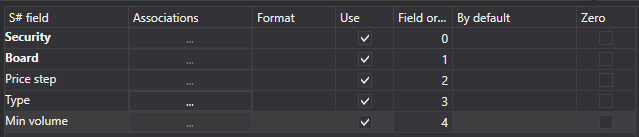

# 銘柄

銘柄をインポートするには、**Import \=\> Instruments** タブを選択します。


## インポート プロセス。

1. **Import settings.**.

   [ローソク足](candles.md) のインポートを参照してください。
2. [S#](../../api.md) フィールドのインポート パラメーターを設定します。

   [ローソク足](candles.md) のインポートを参照してください。

   **CSV ファイルから銘柄をインポートする例を考えてみましょう:**
   - インポートするデータが含まれるファイルには、次のテンプレートがあります。

     ```none
     {SecurityId.SecurityCode};{SecurityId.BoardCode};{PriceStep};{SecurityType};{VolumeStep}
     	  				
     ```

     ここで、{SecurityId.SecurityCode} と {SecurityId.BoardCode} の値は、それぞれ **Security** と **Board** の値に対応します。したがって、**Field order** フィールドでは、それぞれ 0 と 1 の値を割り当てます。
   - {PriceStep} フィールドについては、**S# field** ウィンドウから **Nominal** フィールドを選択し、値 2 を割り当てます。
   - {SecurityType} フィールドについては、**S# field** ウィンドウから **Type** フィールド、つまり銘柄タイプ（株式、通貨、先物など）を選択します。値 3 を割り当てます。
   - {VolumeStep} フィールドについては、**S# field** ウィンドウから **Min volume (base)** フィールド、つまり基本または最小銘柄数量を選択します。値 4 を割り当てます
   - フィールド設定ウィンドウは次のようになります:

   ユーザーは、ダウンロードされたデータに対して多数のプロパティを設定できます。インポートするファイル テンプレートに基づいて、プロパティを指定し、シーケンス内の必要な番号を割り当てる必要があります。
3. データをプレビューするには、**プレビュー** ボタンをクリックします。
4. **インポート** ボタンをクリックします。
