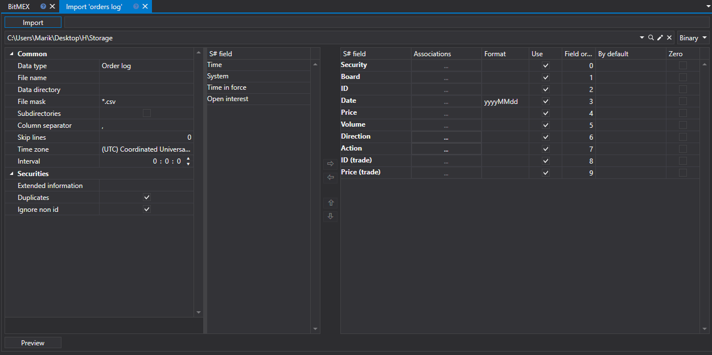

# 注文ログ

注文ログをインポートするには、アプリケーションのメイン メニューから **Import \=\> Order log** 項目を選択します。



## インポート プロセス。

1. **Import settings.**。

   [Candles](candles.md) のインポートを参照してください。
2. [S#](../../api.md) フィールドのインポート パラメーターを設定します。

   [Candles](candles.md) のインポートを参照してください。

   **CSV ファイルから Order Log をインポートする例を考えてみましょう。**
   - インポートするデータのファイルは、次のテンプレートを持っています。

     ```none
     {SecurityId.SecurityCode};{SecurityId.BoardCode};{ServerTime:default:yyyyMMdd};{ServerTime:default:HH:mm:ss.ffffff};{OrderId};{OrderPrice};{OrderVolume};{Side};{OrderState};{TimeInForce};{TradeId};{TradePrice}
     	  				
     ```

     ここで、{SecurityId.SecurityCode} と {SecurityId.BoardCode} の値は、それぞれ **Security** と **Board** の値に対応します。したがって、**Field order** フィールドには、それぞれ値 0 と 1 を割り当てます。
   - {ServerTime:default:yyyyMMdd} と {ServerTime:default:HH:mm:ss.ffffff} フィールドについては、**S# field** ウィンドウからそれぞれ **Date** と **Time** フィールドを選択します。値 2 と 3 を割り当てます。
   - {OrderId} フィールドについては、**S# field** ウィンドウから **ID** フィールド、つまり注文 ID を選択します。値 4 を割り当てます。
   - {OrderPrice} フィールドについては、**S# field** ウィンドウから **Price** フィールド、つまり注文価格を選択します。値 5 を割り当てます
   - {OrderVolume} フィールドについては、**S# field** ウィンドウから **Volume** フィールド、つまり注文数量を選択します。値 6 を割り当てます。
   - {Side} フィールドについては、**S# field** ウィンドウから **Direction** フィールド、つまり注文方向（buy または sell）を選択します。値 7 を割り当てます。
   - {OrderState} フィールドについては、**S# field** ウィンドウから **Action** フィールド、つまり注文状態（active、inactive、または error）を選択します。値 8 を割り当てます。
   - {TimeInForce} フィールドについては、**S# field** ウィンドウから **Time** in force、つまり指値注文の執行条件を選択します。値 9 を割り当てます。
   - {TradeId} フィールドについては、**S# field** ウィンドウから **ID (trade)** フィールド、つまり取引識別子を選択します。値 10 を割り当てます。
   - {TradePrice} フィールドについては、**S# field** ウィンドウから **Price (trade)** フィールド、つまり取引価格を選択します。値 11 を割り当てます。
   - フィールド設定ウィンドウは次のようになります。

   ユーザーは、ダウンロードされたデータに対して多数のプロパティを設定できます。インポートするファイル テンプレートに基づいて、プロパティを指定し、シーケンス内で必要な番号を割り当てる必要があります。 
3. データをプレビューするには、**Preview** ボタンをクリックします。
4. **Import** ボタンをクリックします。
