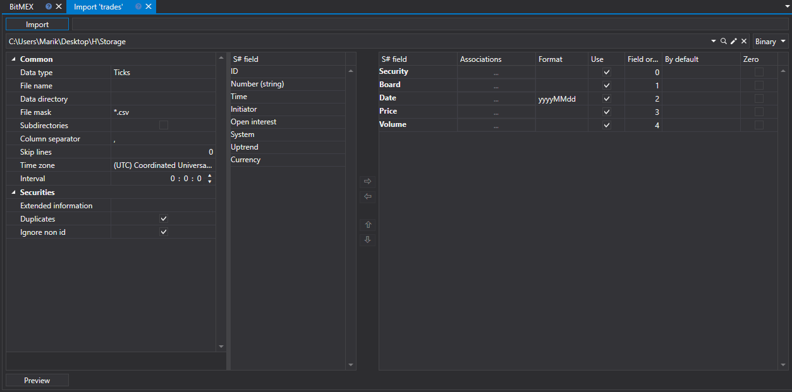
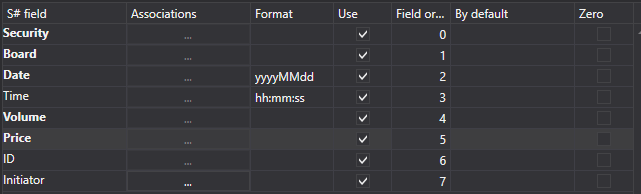

# ティック

取引をインポートするには、**インポート \=\> Ticks** タブを選択します。



## インポート プロセス。

1. **インポート設定**。

   [ローソク足](candles.md) のインポートを参照してください。
2. [S#](../../api.md) フィールドのインポート パラメーターを設定します。

   [ローソク足](candles.md) のインポートを参照してください。

   **CSV ファイルから取引（ティック）をインポートする例を考えてみましょう。**
   - インポートするデータのファイルは、次のテンプレートを持っています。

     ```none
     {SecurityId.SecurityCode};{SecurityId.BoardCode};{ServerTime:default:yyyyMMdd};{ServerTime:default:HH:mm:ss.ffffff};{TradeId};{TradePrice};{TradeVolume};{OriginSide}

     ```

     ここで、{SecurityId.SecurityCode} と {SecurityId.BoardCode} の値は、それぞれ **銘柄** と **ボード** の値に対応します。したがって、**フィールド順序** フィールドには、それぞれ値 0 と 1 を割り当てます。
   - {ServerTime:default:yyyyMMdd} と {ServerTime:default:HH:mm:ss.ffffff} フィールドについては、**S# フィールド** ウィンドウからそれぞれ **日付** と **時刻** フィールドを選択します。値 2 と 3 を割り当てます。
   - {TradeId} フィールドについては、**S# フィールド** ウィンドウから **識別子** フィールド、つまり取引識別子または取引番号を選択します。値 4 を割り当てます。
   - {TradePrice} フィールドについては、**S# フィールド** ウィンドウから **価格** フィールド、つまり取引価格を選択します。値 5 を割り当てます。
   - {TradeVolume} フィールドについては、**S# フィールド** ウィンドウから **数量** フィールド、つまり取引数量を選択します。値 6 を割り当てます。
   - {OriginSide} フィールドについては、**S# フィールド** ウィンドウから **イニシエーター** フィールド、つまり取引のイニシエーター（売り手または買い手）を選択します。値 7 を割り当てます。
   - フィールド設定ウィンドウは次のようになります。

   ユーザーは、ダウンロードされたデータに対して多数のプロパティを設定できます。インポートするファイル テンプレートに基づいて、プロパティを指定し、シーケンス内で必要な番号を割り当てる必要があります。
3. データをプレビューするには、**プレビュー** ボタンをクリックします。
4. **インポート** ボタンをクリックします。
