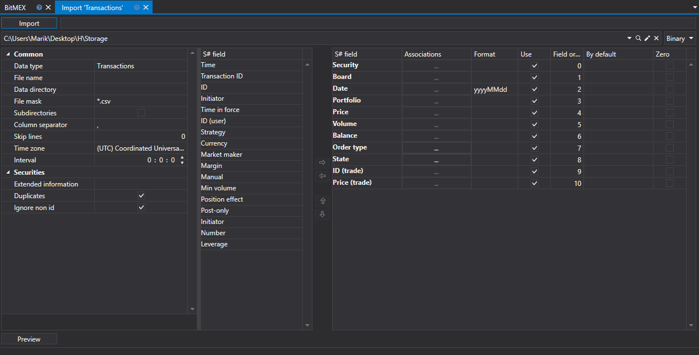

# トランザクション

自分のトランザクションをインポートするには、アプリケーションのメイン メニューから **インポート \=\> 自分の取引** を選択する必要があります。

## 自分のトランザクションをインポートするプロセス

1. **CSV インポート設定** を実行します。

   [ローソク足](candles.md) のインポートを参照してください。
2. [S#](../../api.md) フィールドのインポート パラメーターを設定します。

   [ローソク足](candles.md) のインポートを参照してください。
3. データをプレビューするには、**プレビュー** ボタンをクリックします
4. **インポート** ボタンをクリックします。
