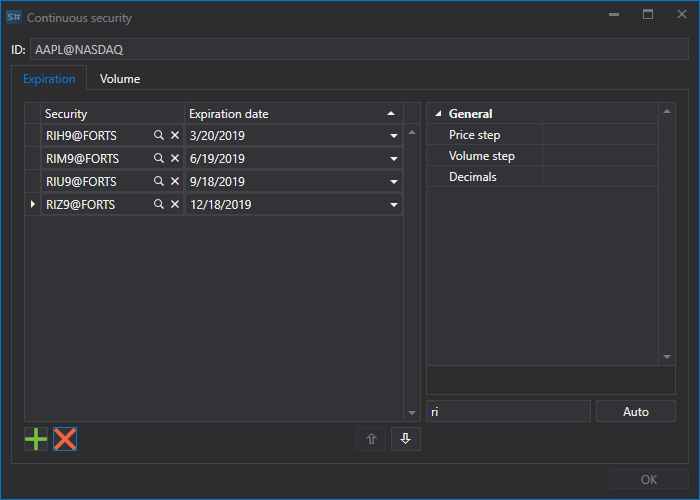

# 連続先物

[Hydra](../../hydra.md) プログラムでは、ユーザーがさまざまな限月の異なる種類のマーケット データを、単一の連続した銘柄に結合できます。

これを行うには、**共通** タブで **銘柄** を選択し、**すべての銘柄** タブが表示されるようにします。データを結合する前に、どのマーケット データが利用可能かを確認します。データが配置されているパスを選択し、結合する予定の銘柄を確認します。欠落がある場合は、不足しているマーケット データをダウンロードします（たとえば、サポートされているデータ ソースから）。

例として、E-mini S&P 500 先物の結合を考えます。

1. 連続先物契約を作成するには、**すべての銘柄** タブで **銘柄を作成 \=\> 連続銘柄** ボタンをクリックします。

   その後、次のウィンドウが表示されます。
2. 連続先物を作成するには、名前を指定して限月を追加する必要があります。

   限月を追加する方法は 2 つあります。
   -  ボタンをクリックして手動で追加します。
   - たとえば RI のように、限月の先頭 2 文字を名前として設定して **自動** ボタンをクリックすると、データベース内で見つかったすべての銘柄が追加されます。
3. 必要な限月を選択し、その移行日を設定します。 
4. 次に、銘柄識別子 **ES\_continuous@CME** を割り当て、**OK** ボタンをクリックします。その後、新しい銘柄が作成されます。
5. 次に、**共通** タブの [ローソク足](../working_with_data/view_and_export/candles.md) ボタンをクリックし、作成された銘柄とデータ期間を選択し、**作成元** フィールドで **複合要素** の値を設定してから、 ボタンをクリックします。 

生成されたデータは、Excel、XML、JSON、または TXT 形式にエクスポートできます。エクスポートはドロップダウン リストを使用して実行されます。

