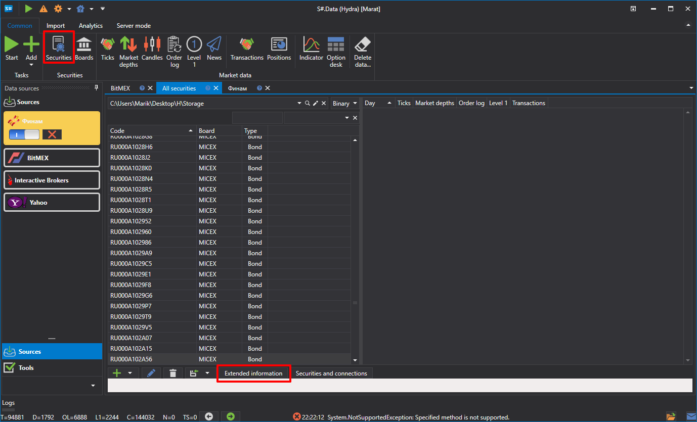
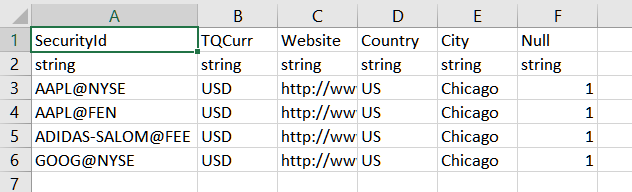

# 拡張銘柄情報

拡張情報のソースは、`c:\\Users\\Users\\Documents\\StockSharp\\Hydra\\Extended info\\` フォルダーに配置された **CSV** ファイルです。これらは [Hydra](../../hydra.md) の起動時に自動的に読み込まれます。

拡張情報には、銘柄に関する任意の追加詳細情報（たとえば、国、都市、取引ボードなど）を含めることができます。

各拡張情報ソース（CSV ファイル）には、銘柄のリストと利用可能なプロパティが含まれています。各ソースの拡張情報は一意です。

ソースに銘柄の拡張情報が含まれていない場合、銘柄リスト内の対応する列は空になります。

必要な拡張情報を選択するには、次の手順を実行します。

1. **Securities** タブで **Extended information** ボタンをクリックします。
2. 必要な CSV ファイルへのパスを選択するウィンドウが表示されます。

以下は、拡張情報の **CSV** ファイルを **MS Excel** と **Notepad** という異なるエディターで開いた例です。

