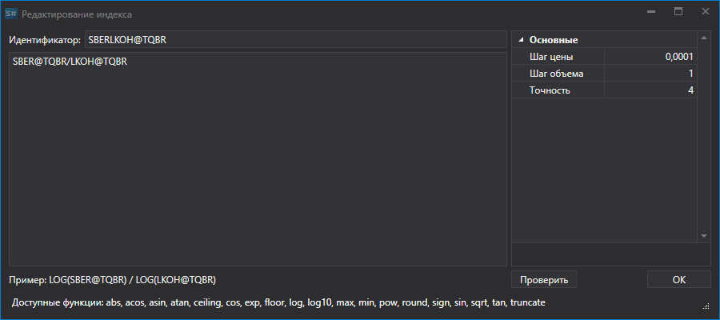

# インデックス

[Hydra](../../hydra.md) を使用すると、独自のインデックスを作成できます。

**Common** タブで **Securities** を選択し、**All Securities** タブが表示されるようにします。

**Index** を作成する前に、利用可能なマーケットデータを確認してください。データが保存されているパスを選択し、インデックスの計算に参加させる銘柄を順番に確認します。欠落がある場合は、サポートされているデータソースから必要なマーケットデータをダウンロードします。

例として、銘柄比率インデックス AAPL@NYSE\/GOOG@NYSE を考えます。

1. 最初の手順は **Index** の作成です。**All Securities** タブで **Create security \=\> Index** をクリックします。
2. 次のウィンドウが表示されます。
3. **Index** 銘柄を作成するには、名前を指定し、複数の銘柄を組み合わせるための数式を追加します。標準的な数学演算子とあわせて、次の関数を使用できます。
   - **abs(a)** - 数値の絶対値を返します。
   - **acos(a)** - 指定した数値と等しい余弦を持つ角度を返します。
   - **asin(a)** - 指定した数値と等しい正弦を持つ角度を返します。
   - **atan(a)** - 指定した数値と等しい正接を持つ角度を返します。
   - **ceiling(a)** - 指定した数値以上の最小の整数を返します。
   - **cos(a)** - 指定した角度の余弦を返します。
   - **exp(a)** - **e** を指定した累乗にした値を返します。
   - **floor(a)** - 指定した数値以下の最大の整数を返します。
   - **log(a)** - 指定した数値の自然対数（底 **e**）を返します。
   - **log10(a)** - 指定した数値の常用対数を返します。
   - **max (a, b)** - 2 つの 10 進数のうち大きい方を返します。
   - **min(a, b)** - 2 つの 10 進数のうち小さい方を返します。
   - **pow(a, b)** - 指定した数値を指定した累乗にした値を返します。
   - **sign(a)** - 指定した数値の符号を示す整数を返します。
   - **sin(a)** - 指定した角度の正弦を返します。
   - **sqrt (a)** - 指定した数値の平方根を返します。
   - **tan(a)** - 指定した角度の正接を返します。
   - **truncate(a)** - 指定した数値の整数部を計算します。
4. インデックスの計算に使用する数学演算を入力します。
5. 次に、**Common** タブで [ローソク足](../working_with_data/view_and_export/candles.md) をクリックし、作成した **Index** 銘柄とデータ期間を選択し、**Create From:** フィールドで **Composite Element** を設定してから、 をクリックします。

生成されたデータは Excel、XML、または TXT 形式にエクスポートできます。エクスポートはドロップダウンリストを使用して行います。

